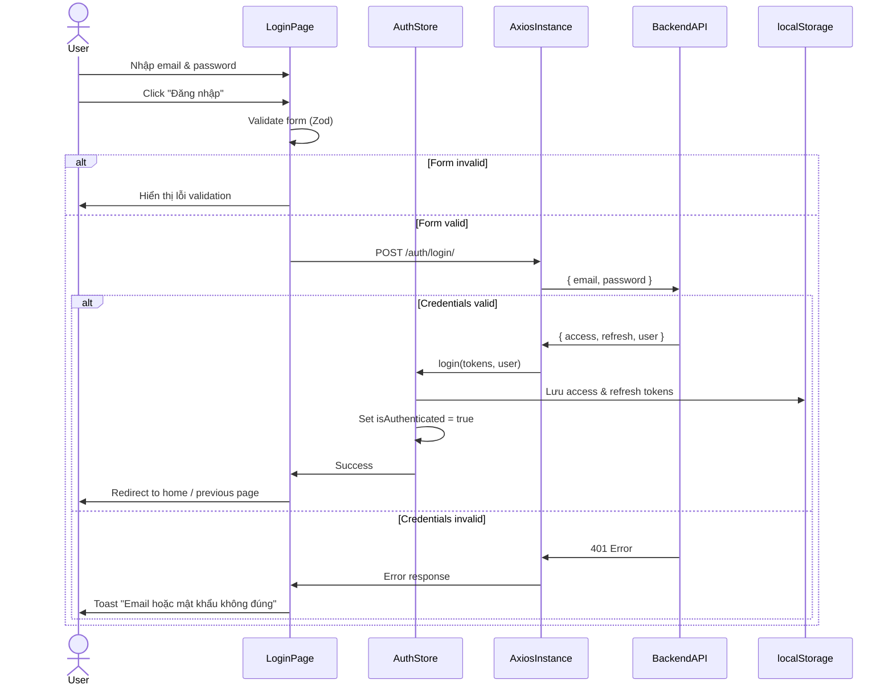
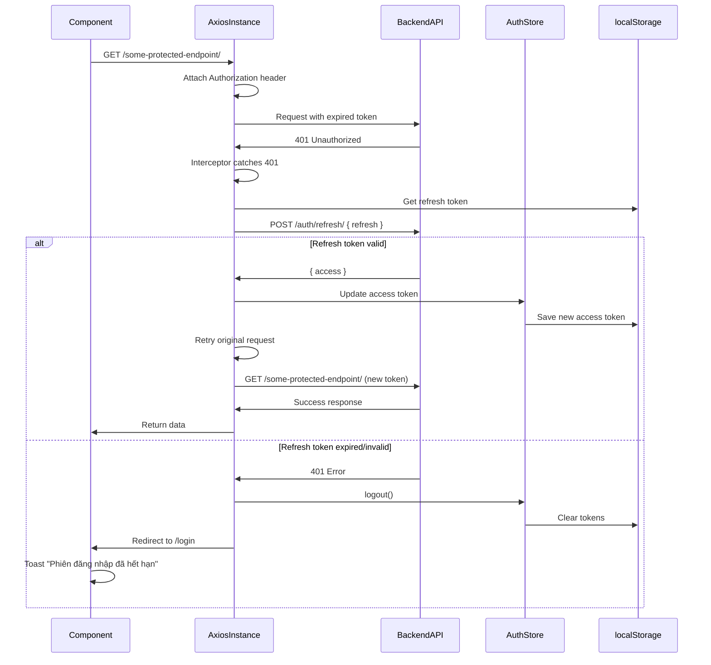
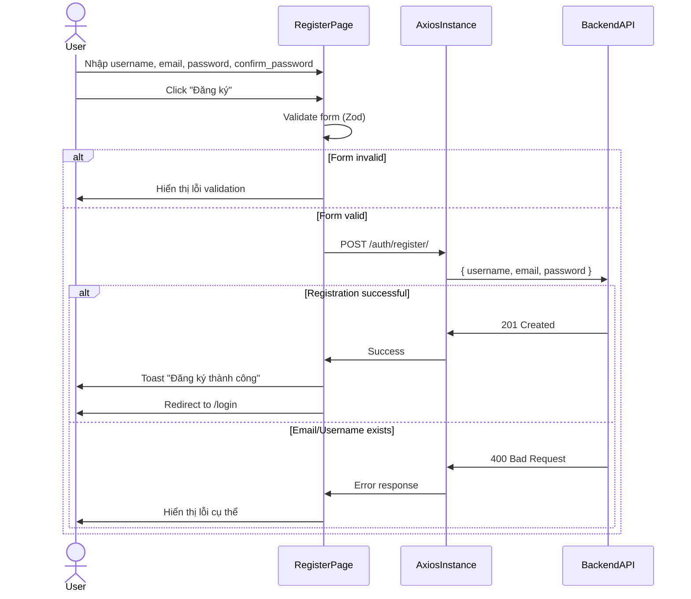
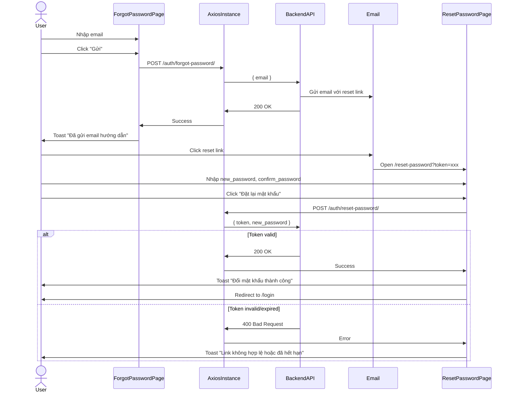

# Design Document: Frontend Phase 1-2 (Setup & Authentication)

## Overview

Design document này mô tả kiến trúc và thiết kế chi tiết cho Phase 1 (Setup & Cấu hình dự án) và Phase 2 (Authentication) của KitchenMate Frontend. Đây là nền tảng cơ bản cho ứng dụng web React, bao gồm:

- Khởi tạo và cấu hình dự án React với Vite
- Cài đặt và tích hợp các thư viện cần thiết (Tailwind CSS, React Router, Axios, React Query, Zustand)
- Xây dựng hệ thống authentication hoàn chỉnh (đăng ký, đăng nhập, quên mật khẩu, token management)
- Thiết lập routing và protected routes
- Xử lý lỗi và loading states

**Tech Stack:**
- **Build Tool**: Vite
- **Framework**: React 18 (Functional Components + Hooks)
- **Styling**: Tailwind CSS v3
- **Routing**: React Router v6
- **HTTP Client**: Axios
- **Data Fetching**: TanStack Query v5 (React Query)
- **State Management**: Zustand
- **Form Handling**: React Hook Form + Zod
- **UI Components**: @headlessui/react, react-icons, react-hot-toast
- **Backend API**: Django REST Framework tại http://localhost:8000/api/

**Mục tiêu chính:**
1. Tạo môi trường phát triển hiện đại, nhanh với Vite
2. Xây dựng hệ thống authentication an toàn với JWT
3. Thiết lập foundation vững chắc cho các phase tiếp theo
4. Đảm bảo responsive design (mobile-first)
5. Tối ưu hóa performance với React Query caching

## Architecture

### High-Level Architecture

```
┌─────────────────────────────────────────────────────────────┐
│                     Browser (Client)                         │
├─────────────────────────────────────────────────────────────┤
│                                                               │
│  ┌──────────────────────────────────────────────────────┐  │
│  │              React Application (Vite)                 │  │
│  │                                                        │  │
│  │  ┌──────────────┐  ┌──────────────┐  ┌────────────┐ │  │
│  │  │   Pages      │  │  Components  │  │   Layouts  │ │  │
│  │  │ (Routes)     │  │  (Reusable)  │  │            │ │  │
│  │  └──────────────┘  └──────────────┘  └────────────┘ │  │
│  │                                                        │  │
│  │  ┌──────────────────────────────────────────────────┐│  │
│  │  │         State Management Layer                    ││  │
│  │  │  ┌──────────────┐  ┌──────────────────────────┐ ││  │
│  │  │  │ Zustand      │  │  React Query (Cache)     │ ││  │
│  │  │  │ (Auth Store) │  │  (Server State)          │ ││  │
│  │  │  └──────────────┘  └──────────────────────────┘ ││  │
│  │  └──────────────────────────────────────────────────┘│  │
│  │                                                        │  │
│  │  ┌──────────────────────────────────────────────────┐│  │
│  │  │         API Communication Layer                   ││  │
│  │  │  ┌──────────────────────────────────────────┐   ││  │
│  │  │  │  Axios Instance (with Interceptors)      │   ││  │
│  │  │  │  - Auto attach JWT token                 │   ││  │
│  │  │  │  - Auto refresh on 401                   │   ││  │
│  │  │  │  - Error handling                        │   ││  │
│  │  │  └──────────────────────────────────────────┘   ││  │
│  │  └──────────────────────────────────────────────────┘│  │
│  │                                                        │  │
│  │  ┌──────────────────────────────────────────────────┐│  │
│  │  │         Persistence Layer                         ││  │
│  │  │  localStorage: { accessToken, refreshToken }     ││  │
│  │  └──────────────────────────────────────────────────┘│  │
│  └──────────────────────────────────────────────────────┘  │
│                                                               │
└───────────────────────┬───────────────────────────────────────┘
                        │ HTTP/HTTPS (JSON)
                        │ Authorization: Bearer <token>
                        ▼
┌─────────────────────────────────────────────────────────────┐
│              Backend API (Django REST Framework)             │
│                  http://localhost:8000/api/                  │
│                                                               │
│  Endpoints:                                                   │
│  - POST /auth/register/                                       │
│  - POST /auth/login/                                          │
│  - POST /auth/refresh/                                        │
│  - POST /auth/logout/                                         │
│  - POST /auth/forgot-password/                                │
│  - POST /auth/reset-password/                                 │
│  - GET  /accounts/me/                                         │
│  - PATCH /accounts/me/                                        │
└─────────────────────────────────────────────────────────────┘
```

**Kiến trúc phân tầng:**

1. **Presentation Layer** (Pages + Components + Layouts)
   - Hiển thị UI và xử lý user interactions
   - Sử dụng Tailwind CSS cho styling
   - Mobile-first responsive design

2. **State Management Layer**
   - **Zustand Store**: Quản lý auth state (user, tokens, isAuthenticated)
   - **React Query**: Cache và sync server state, tự động refetch

3. **API Communication Layer**
   - **Axios Instance**: Centralized HTTP client với interceptors
   - Tự động attach JWT token vào mọi request
   - Tự động refresh token khi nhận 401
   - Xử lý errors thống nhất

4. **Persistence Layer**
   - localStorage: Lưu trữ tokens để persist session qua browser restarts

### Authentication Flow


#### Login Flow



#### Token Refresh Flow



#### Registration Flow



#### Forgot Password Flow



### Routing Architecture

**Route Structure:**

```
/                          → MainLayout → HomePage (public)
/login                     → AuthLayout → LoginPage (public)
/register                  → AuthLayout → RegisterPage (public)
/forgot-password           → AuthLayout → ForgotPasswordPage (public)
/reset-password?token=xxx  → AuthLayout → ResetPasswordPage (public)

/profile                   → MainLayout → ProtectedRoute → ProfilePage
/my-recipes                → MainLayout → ProtectedRoute → MyRecipesPage
/recipes/create            → MainLayout → ProtectedRoute → CreateRecipePage

/admin/*                   → AdminLayout → AdminRoute → AdminPages
```

**Layout Components:**

1. **AuthLayout**: Dành cho trang đăng nhập/đăng ký
   - Không có navbar/footer
   - Centered form với background gradient
   - Logo ở trên cùng

2. **MainLayout**: Dành cho các trang chính
   - Navbar (desktop) với logo, search, user menu
   - Bottom navigation (mobile) với 5 tabs
   - Main content area
   - Footer (optional)

3. **AdminLayout**: Dành cho trang admin
   - Sidebar navigation
   - Header với breadcrumbs
   - Main content area

**Protected Route Logic:**

```javascript
// ProtectedRoute.jsx
function ProtectedRoute({ children }) {
  const { isAuthenticated } = useAuthStore();
  const location = useLocation();
  
  if (!isAuthenticated) {
    // Lưu URL hiện tại để redirect về sau khi login
    return <Navigate to="/login" state={{ from: location }} replace />;
  }
  
  return children;
}

// AdminRoute.jsx
function AdminRoute({ children }) {
  const { isAuthenticated, user } = useAuthStore();
  const location = useLocation();
  
  if (!isAuthenticated) {
    return <Navigate to="/login" state={{ from: location }} replace />;
  }
  
  if (!user?.is_staff && !user?.is_superuser) {
    toast.error("Bạn không có quyền truy cập");
    return <Navigate to="/" replace />;
  }
  
  return children;
}
```

## Components and Interfaces

### Folder Structure

```
src/
├── api/
│   ├── axiosInstance.js       # Axios instance với interceptors
│   ├── authApi.js              # Auth API calls (login, register, etc.)
│   └── index.js                # Export tất cả API functions
│
├── assets/
│   ├── images/                 # Ảnh tĩnh (logo, placeholders)
│   └── icons/                  # Custom icons (nếu có)
│
├── components/
│   ├── common/
│   │   ├── Button.jsx          # Reusable button component
│   │   ├── Input.jsx           # Reusable input component
│   │   ├── LoadingSpinner.jsx  # Loading spinner
│   │   ├── Toast.jsx           # Toast notification wrapper
│   │   └── ErrorBoundary.jsx   # Error boundary component
│   │
│   ├── forms/
│   │   ├── LoginForm.jsx       # Login form với validation
│   │   ├── RegisterForm.jsx    # Register form với validation
│   │   ├── ForgotPasswordForm.jsx
│   │   └── ResetPasswordForm.jsx
│   │
│   └── layout/
│       ├── Navbar.jsx          # Desktop navbar
│       ├── BottomNav.jsx       # Mobile bottom navigation
│       ├── UserMenu.jsx        # User dropdown menu
│       └── Footer.jsx          # Footer component
│
├── hooks/
│   ├── useAuth.js              # Custom hook for auth operations
│   ├── useForm.js              # Custom hook for form handling
│   └── useToast.js             # Custom hook for toast notifications
│
├── layouts/
│   ├── AuthLayout.jsx          # Layout cho auth pages
│   ├── MainLayout.jsx          # Layout cho main pages
│   └── AdminLayout.jsx         # Layout cho admin pages
│
├── pages/
│   ├── auth/
│   │   ├── LoginPage.jsx
│   │   ├── RegisterPage.jsx
│   │   ├── ForgotPasswordPage.jsx
│   │   └── ResetPasswordPage.jsx
│   │
│   ├── HomePage.jsx
│   ├── ProfilePage.jsx
│   └── NotFoundPage.jsx
│
├── routes/
│   ├── AppRoutes.jsx           # Main route configuration
│   ├── ProtectedRoute.jsx      # Protected route wrapper
│   └── AdminRoute.jsx          # Admin route wrapper
│
├── stores/
│   └── authStore.js            # Zustand auth store
│
├── utils/
│   ├── constants.js            # App constants
│   ├── validators.js           # Zod validation schemas
│   ├── helpers.js              # Helper functions
│   └── storage.js              # localStorage utilities
│
├── App.jsx                     # Root component
├── main.jsx                    # Entry point
└── index.css                   # Global styles + Tailwind imports
```

### Core Components

#### 1. Axios Instance (`src/api/axiosInstance.js`)

**Purpose**: Centralized HTTP client với automatic token management và error handling.

**Interface:**

```javascript
// axiosInstance.js
import axios from 'axios';
import { useAuthStore } from '../stores/authStore';

const axiosInstance = axios.create({
  baseURL: import.meta.env.VITE_API_BASE_URL || 'http://localhost:8000/api',
  timeout: 30000,
  headers: {
    'Content-Type': 'application/json',
  },
});

// Request interceptor: Attach access token
axiosInstance.interceptors.request.use(
  (config) => {
    const token = useAuthStore.getState().accessToken;
    if (token) {
      config.headers.Authorization = `Bearer ${token}`;
    }
    return config;
  },
  (error) => Promise.reject(error)
);

// Response interceptor: Handle 401 and refresh token
let isRefreshing = false;
let failedQueue = [];

const processQueue = (error, token = null) => {
  failedQueue.forEach(prom => {
    if (error) {
      prom.reject(error);
    } else {
      prom.resolve(token);
    }
  });
  failedQueue = [];
};

axiosInstance.interceptors.response.use(
  (response) => response,
  async (error) => {
    const originalRequest = error.config;

    // If error is not 401 or already retried, reject
    if (error.response?.status !== 401 || originalRequest._retry) {
      return Promise.reject(error);
    }

    // If already refreshing, queue this request
    if (isRefreshing) {
      return new Promise((resolve, reject) => {
        failedQueue.push({ resolve, reject });
      })
        .then(token => {
          originalRequest.headers.Authorization = `Bearer ${token}`;
          return axiosInstance(originalRequest);
        })
        .catch(err => Promise.reject(err));
    }

    originalRequest._retry = true;
    isRefreshing = true;

    const refreshToken = useAuthStore.getState().refreshToken;

    if (!refreshToken) {
      useAuthStore.getState().logout();
      window.location.href = '/login';
      return Promise.reject(error);
    }

    try {
      const response = await axios.post(
        `${import.meta.env.VITE_API_BASE_URL}/auth/refresh/`,
        { refresh: refreshToken }
      );

      const { access } = response.data;
      useAuthStore.getState().setAccessToken(access);

      processQueue(null, access);
      originalRequest.headers.Authorization = `Bearer ${access}`;
      return axiosInstance(originalRequest);
    } catch (refreshError) {
      processQueue(refreshError, null);
      useAuthStore.getState().logout();
      window.location.href = '/login';
      return Promise.reject(refreshError);
    } finally {
      isRefreshing = false;
    }
  }
);

export default axiosInstance;
```

**Key Features:**
- Automatic token attachment
- Token refresh on 401
- Request queuing during refresh
- Automatic logout on refresh failure
- Timeout handling (30s)

#### 2. Auth Store (`src/stores/authStore.js`)

**Purpose**: Global state management cho authentication.

**Interface:**

```javascript
// authStore.js
import { create } from 'zustand';
import { persist } from 'zustand/middleware';

export const useAuthStore = create(
  persist(
    (set, get) => ({
      // State
      user: null,
      accessToken: null,
      refreshToken: null,
      isAuthenticated: false,

      // Actions
      login: (tokens, user) => {
        set({
          user,
          accessToken: tokens.access,
          refreshToken: tokens.refresh,
          isAuthenticated: true,
        });
      },

      logout: () => {
        set({
          user: null,
          accessToken: null,
          refreshToken: null,
          isAuthenticated: false,
        });
        localStorage.removeItem('auth-storage');
      },

      setUser: (user) => {
        set({ user });
      },

      setAccessToken: (token) => {
        set({ accessToken: token });
      },

      refreshAccessToken: async () => {
        const { refreshToken } = get();
        if (!refreshToken) {
          get().logout();
          return null;
        }

        try {
          const response = await fetch(
            `${import.meta.env.VITE_API_BASE_URL}/auth/refresh/`,
            {
              method: 'POST',
              headers: { 'Content-Type': 'application/json' },
              body: JSON.stringify({ refresh: refreshToken }),
            }
          );

          if (!response.ok) throw new Error('Refresh failed');

          const data = await response.json();
          set({ accessToken: data.access });
          return data.access;
        } catch (error) {
          get().logout();
          return null;
        }
      },
    }),
    {
      name: 'auth-storage',
      partialize: (state) => ({
        accessToken: state.accessToken,
        refreshToken: state.refreshToken,
        user: state.user,
        isAuthenticated: state.isAuthenticated,
      }),
    }
  )
);
```

**State Schema:**

```typescript
interface AuthState {
  user: {
    id: string;
    username: string;
    email: string;
    display_name: string;
    avatar_url: string | null;
    is_staff: boolean;
    is_superuser: boolean;
  } | null;
  accessToken: string | null;
  refreshToken: string | null;
  isAuthenticated: boolean;
}
```

#### 3. Auth API Functions (`src/api/authApi.js`)

**Purpose**: Wrapper functions cho auth-related API calls.

**Interface:**

```javascript
// authApi.js
import axiosInstance from './axiosInstance';

export const authApi = {
  // Register new user
  register: async (userData) => {
    const response = await axiosInstance.post('/auth/register/', userData);
    return response.data;
  },

  // Login user
  login: async (credentials) => {
    const response = await axiosInstance.post('/auth/login/', credentials);
    return response.data;
  },

  // Logout user
  logout: async (refreshToken) => {
    const response = await axiosInstance.post('/auth/logout/', {
      refresh: refreshToken,
    });
    return response.data;
  },

  // Request password reset
  forgotPassword: async (email) => {
    const response = await axiosInstance.post('/auth/forgot-password/', {
      email,
    });
    return response.data;
  },

  // Reset password with token
  resetPassword: async (token, newPassword) => {
    const response = await axiosInstance.post('/auth/reset-password/', {
      token,
      new_password: newPassword,
    });
    return response.data;
  },

  // Get current user info
  getCurrentUser: async () => {
    const response = await axiosInstance.get('/accounts/me/');
    return response.data;
  },

  // Update user profile
  updateProfile: async (userData) => {
    const response = await axiosInstance.patch('/accounts/me/', userData);
    return response.data;
  },
};
```

#### 4. Form Validation Schemas (`src/utils/validators.js`)

**Purpose**: Zod schemas cho form validation.

**Interface:**

```javascript
// validators.js
import { z } from 'zod';

export const loginSchema = z.object({
  email: z
    .string()
    .min(1, 'Email không được để trống')
    .email('Email không hợp lệ'),
  password: z.string().min(1, 'Mật khẩu không được để trống'),
});

export const registerSchema = z
  .object({
    username: z
      .string()
      .min(3, 'Username phải có ít nhất 3 ký tự')
      .max(150, 'Username không được quá 150 ký tự')
      .regex(
        /^[a-zA-Z0-9_]+$/,
        'Username chỉ được chứa chữ cái, số và dấu gạch dưới'
      ),
    email: z
      .string()
      .min(1, 'Email không được để trống')
      .email('Email không hợp lệ'),
    password: z
      .string()
      .min(8, 'Mật khẩu phải có ít nhất 8 ký tự')
      .regex(/[A-Z]/, 'Mật khẩu phải có ít nhất 1 chữ hoa')
      .regex(/[a-z]/, 'Mật khẩu phải có ít nhất 1 chữ thường')
      .regex(/[0-9]/, 'Mật khẩu phải có ít nhất 1 số'),
    confirm_password: z.string().min(1, 'Vui lòng xác nhận mật khẩu'),
  })
  .refine((data) => data.password === data.confirm_password, {
    message: 'Mật khẩu xác nhận không khớp',
    path: ['confirm_password'],
  });

export const forgotPasswordSchema = z.object({
  email: z
    .string()
    .min(1, 'Email không được để trống')
    .email('Email không hợp lệ'),
});

export const resetPasswordSchema = z
  .object({
    new_password: z
      .string()
      .min(8, 'Mật khẩu phải có ít nhất 8 ký tự')
      .regex(/[A-Z]/, 'Mật khẩu phải có ít nhất 1 chữ hoa')
      .regex(/[a-z]/, 'Mật khẩu phải có ít nhất 1 chữ thường')
      .regex(/[0-9]/, 'Mật khẩu phải có ít nhất 1 số'),
    confirm_password: z.string().min(1, 'Vui lòng xác nhận mật khẩu'),
  })
  .refine((data) => data.new_password === data.confirm_password, {
    message: 'Mật khẩu xác nhận không khớp',
    path: ['confirm_password'],
  });
```

#### 5. Login Form Component (`src/components/forms/LoginForm.jsx`)

**Purpose**: Reusable login form với validation và error handling.

**Props Interface:**

```typescript
interface LoginFormProps {
  onSuccess?: (user: User) => void;
  redirectTo?: string;
}
```

**Component Structure:**

```javascript
// LoginForm.jsx
import { useForm } from 'react-hook-form';
import { zodResolver } from '@hookform/resolvers/zod';
import { loginSchema } from '../../utils/validators';
import { authApi } from '../../api/authApi';
import { useAuthStore } from '../../stores/authStore';
import { useNavigate, useLocation } from 'react-router-dom';
import toast from 'react-hot-toast';

export function LoginForm({ onSuccess, redirectTo }) {
  const navigate = useNavigate();
  const location = useLocation();
  const login = useAuthStore((state) => state.login);

  const {
    register,
    handleSubmit,
    formState: { errors, isSubmitting },
  } = useForm({
    resolver: zodResolver(loginSchema),
  });

  const onSubmit = async (data) => {
    try {
      const response = await authApi.login(data);
      login(
        { access: response.access, refresh: response.refresh },
        response.user
      );
      
      toast.success('Đăng nhập thành công!');
      
      if (onSuccess) {
        onSuccess(response.user);
      }
      
      // Redirect to previous page or home
      const from = location.state?.from?.pathname || redirectTo || '/';
      navigate(from, { replace: true });
    } catch (error) {
      const message =
        error.response?.data?.detail ||
        error.response?.data?.message ||
        'Email hoặc mật khẩu không đúng';
      toast.error(message);
    }
  };

  return (
    <form onSubmit={handleSubmit(onSubmit)} className="space-y-4">
      {/* Email field */}
      <div>
        <label htmlFor="email" className="block text-sm font-medium text-gray-700">
          Email
        </label>
        <input
          {...register('email')}
          type="email"
          id="email"
          disabled={isSubmitting}
          className="mt-1 block w-full rounded-md border-gray-300 shadow-sm focus:border-primary focus:ring-primary sm:text-sm"
        />
        {errors.email && (
          <p className="mt-1 text-sm text-red-600">{errors.email.message}</p>
        )}
      </div>

      {/* Password field */}
      <div>
        <label htmlFor="password" className="block text-sm font-medium text-gray-700">
          Mật khẩu
        </label>
        <input
          {...register('password')}
          type="password"
          id="password"
          disabled={isSubmitting}
          className="mt-1 block w-full rounded-md border-gray-300 shadow-sm focus:border-primary focus:ring-primary sm:text-sm"
        />
        {errors.password && (
          <p className="mt-1 text-sm text-red-600">{errors.password.message}</p>
        )}
      </div>

      {/* Submit button */}
      <button
        type="submit"
        disabled={isSubmitting}
        className="w-full flex justify-center py-2 px-4 border border-transparent rounded-md shadow-sm text-sm font-medium text-white bg-primary hover:bg-primary-dark focus:outline-none focus:ring-2 focus:ring-offset-2 focus:ring-primary disabled:opacity-50 disabled:cursor-not-allowed"
      >
        {isSubmitting ? 'Đang đăng nhập...' : 'Đăng nhập'}
      </button>
    </form>
  );
}
```

#### 6. Protected Route Component (`src/routes/ProtectedRoute.jsx`)

**Purpose**: Wrapper component để bảo vệ routes yêu cầu authentication.

**Interface:**

```javascript
// ProtectedRoute.jsx
import { Navigate, useLocation } from 'react-router-dom';
import { useAuthStore } from '../stores/authStore';

export function ProtectedRoute({ children }) {
  const isAuthenticated = useAuthStore((state) => state.isAuthenticated);
  const location = useLocation();

  if (!isAuthenticated) {
    // Redirect to login, save current location
    return <Navigate to="/login" state={{ from: location }} replace />;
  }

  return children;
}
```

## Data Models

### User Model (Frontend)

```typescript
interface User {
  id: string;                    // UUID
  username: string;              // Unique username
  email: string;                 // User email
  display_name: string;          // Display name
  avatar_url: string | null;     // Avatar URL (nullable)
  bio: string;                   // User bio
  is_staff: boolean;             // Staff status
  is_superuser: boolean;         // Superuser status
  date_joined: string;           // ISO date string
}
```

### Auth Tokens Model

```typescript
interface AuthTokens {
  access: string;                // JWT access token (short-lived)
  refresh: string;               // JWT refresh token (long-lived)
}
```

### Login Request/Response

**Request:**
```typescript
interface LoginRequest {
  email: string;
  password: string;
}
```

**Response:**
```typescript
interface LoginResponse {
  access: string;
  refresh: string;
  user: User;
}
```

### Register Request/Response

**Request:**
```typescript
interface RegisterRequest {
  username: string;
  email: string;
  password: string;
}
```

**Response:**
```typescript
interface RegisterResponse {
  id: string;
  username: string;
  email: string;
  message: string;              // "User registered successfully"
}
```

### Forgot Password Request/Response

**Request:**
```typescript
interface ForgotPasswordRequest {
  email: string;
}
```

**Response:**
```typescript
interface ForgotPasswordResponse {
  message: string;              // "Password reset email sent"
}
```

### Reset Password Request/Response

**Request:**
```typescript
interface ResetPasswordRequest {
  token: string;
  new_password: string;
}
```

**Response:**
```typescript
interface ResetPasswordResponse {
  message: string;              // "Password reset successful"
}
```

### API Error Response

```typescript
interface APIError {
  detail?: string;              // Single error message
  message?: string;             // Alternative error message
  errors?: {                    // Field-specific errors
    [field: string]: string[];
  };
  status?: number;              // HTTP status code
}
```

## Error Handling

### Error Handling Strategy

**1. Network Errors**

```javascript
// Handle network errors (no response from server)
if (error.request && !error.response) {
  toast.error('Không thể kết nối đến server. Vui lòng kiểm tra kết nối mạng.');
  return;
}
```

**2. Server Errors (5xx)**

```javascript
// Handle server errors
if (error.response?.status >= 500) {
  toast.error('Có lỗi xảy ra từ phía server. Vui lòng thử lại sau.');
  return;
}
```

**3. Client Errors (4xx)**

```javascript
// Handle validation errors (400)
if (error.response?.status === 400) {
  const errors = error.response.data.errors;
  if (errors) {
    // Display field-specific errors
    Object.keys(errors).forEach(field => {
      setError(field, { message: errors[field][0] });
    });
  } else {
    // Display general error message
    toast.error(error.response.data.detail || 'Dữ liệu không hợp lệ');
  }
  return;
}

// Handle unauthorized (401)
if (error.response?.status === 401) {
  // Handled by axios interceptor (auto refresh or logout)
  return;
}

// Handle forbidden (403)
if (error.response?.status === 403) {
  toast.error('Bạn không có quyền thực hiện thao tác này');
  return;
}

// Handle not found (404)
if (error.response?.status === 404) {
  toast.error('Không tìm thấy tài nguyên');
  return;
}
```

**4. Timeout Errors**

```javascript
// Handle timeout errors
if (error.code === 'ECONNABORTED') {
  toast.error('Yêu cầu quá lâu. Vui lòng thử lại.');
  return;
}
```

### Error Handling Utility

```javascript
// src/utils/errorHandler.js
import toast from 'react-hot-toast';

export const handleApiError = (error, setError = null) => {
  // Network error
  if (error.request && !error.response) {
    toast.error('Không thể kết nối đến server');
    return;
  }

  // Timeout error
  if (error.code === 'ECONNABORTED') {
    toast.error('Yêu cầu quá lâu. Vui lòng thử lại.');
    return;
  }

  const status = error.response?.status;
  const data = error.response?.data;

  // Server error (5xx)
  if (status >= 500) {
    toast.error('Có lỗi xảy ra từ phía server');
    return;
  }

  // Validation error (400)
  if (status === 400) {
    if (data.errors && setError) {
      // Set field-specific errors
      Object.keys(data.errors).forEach(field => {
        setError(field, { message: data.errors[field][0] });
      });
    } else {
      // Show general error
      toast.error(data.detail || data.message || 'Dữ liệu không hợp lệ');
    }
    return;
  }

  // Unauthorized (401) - handled by interceptor
  if (status === 401) {
    return;
  }

  // Forbidden (403)
  if (status === 403) {
    toast.error('Bạn không có quyền thực hiện thao tác này');
    return;
  }

  // Not found (404)
  if (status === 404) {
    toast.error('Không tìm thấy tài nguyên');
    return;
  }

  // Default error
  toast.error(data?.detail || data?.message || 'Có lỗi xảy ra');
};
```

### Loading States

**Form Loading State:**

```javascript
const {
  formState: { isSubmitting },
} = useForm();

// In JSX
<button disabled={isSubmitting}>
  {isSubmitting ? 'Đang xử lý...' : 'Gửi'}
</button>
```

**Page Loading State (React Query):**

```javascript
const { data, isLoading, isError, error } = useQuery({
  queryKey: ['user'],
  queryFn: authApi.getCurrentUser,
});

if (isLoading) {
  return <LoadingSpinner />;
}

if (isError) {
  return <ErrorMessage error={error} />;
}

return <div>{/* Render data */}</div>;
```

**Component Loading State:**

```javascript
// LoadingSpinner.jsx
export function LoadingSpinner({ size = 'md', className = '' }) {
  const sizeClasses = {
    sm: 'h-4 w-4',
    md: 'h-8 w-8',
    lg: 'h-12 w-12',
  };

  return (
    <div className={`flex justify-center items-center ${className}`}>
      <div
        className={`${sizeClasses[size]} animate-spin rounded-full border-4 border-gray-200 border-t-primary`}
      />
    </div>
  );
}
```

### Toast Notifications

**Toast Configuration:**

```javascript
// src/App.jsx
import { Toaster } from 'react-hot-toast';

function App() {
  return (
    <>
      <Toaster
        position="top-right"
        toastOptions={{
          duration: 3000,
          style: {
            background: '#fff',
            color: '#333',
          },
          success: {
            iconTheme: {
              primary: '#4CAF50',
              secondary: '#fff',
            },
          },
          error: {
            iconTheme: {
              primary: '#f44336',
              secondary: '#fff',
            },
          },
        }}
      />
      {/* App routes */}
    </>
  );
}
```

**Toast Usage:**

```javascript
import toast from 'react-hot-toast';

// Success toast
toast.success('Đăng nhập thành công!');

// Error toast
toast.error('Email hoặc mật khẩu không đúng');

// Info toast
toast('Đang xử lý yêu cầu...');

// Loading toast
const toastId = toast.loading('Đang tải...');
// Later: toast.dismiss(toastId);

// Custom toast
toast.custom((t) => (
  <div className={`${t.visible ? 'animate-enter' : 'animate-leave'} ...`}>
    Custom content
  </div>
));
```

## Testing Strategy

### Testing Approach

Vì đây là dự án Frontend với React, và phần lớn requirements liên quan đến:
- UI rendering và layout
- Configuration và setup
- Integration với Backend API
- Side effects (localStorage, redirect, toast notifications)

**Property-Based Testing KHÔNG phù hợp** cho spec này. Thay vào đó, chúng ta sẽ sử dụng:

1. **Unit Tests**: Test các utility functions, validation schemas, helper functions
2. **Component Tests**: Test các React components với React Testing Library
3. **Integration Tests**: Test auth flow end-to-end
4. **Manual Testing**: Test responsive design và UX trên các thiết bị khác nhau

### Unit Tests

**Test Targets:**
- Validation schemas (Zod)
- Helper functions (formatters, parsers)
- Storage utilities (localStorage wrappers)
- Error handler utility

**Example Test (Validation Schema):**

```javascript
// validators.test.js
import { describe, it, expect } from 'vitest';
import { loginSchema, registerSchema } from '../utils/validators';

describe('loginSchema', () => {
  it('should validate correct login data', () => {
    const validData = {
      email: 'user@example.com',
      password: 'password123',
    };
    expect(() => loginSchema.parse(validData)).not.toThrow();
  });

  it('should reject invalid email', () => {
    const invalidData = {
      email: 'invalid-email',
      password: 'password123',
    };
    expect(() => loginSchema.parse(invalidData)).toThrow();
  });

  it('should reject empty password', () => {
    const invalidData = {
      email: 'user@example.com',
      password: '',
    };
    expect(() => loginSchema.parse(invalidData)).toThrow();
  });
});

describe('registerSchema', () => {
  it('should validate correct registration data', () => {
    const validData = {
      username: 'testuser',
      email: 'user@example.com',
      password: 'Password123',
      confirm_password: 'Password123',
    };
    expect(() => registerSchema.parse(validData)).not.toThrow();
  });

  it('should reject password mismatch', () => {
    const invalidData = {
      username: 'testuser',
      email: 'user@example.com',
      password: 'Password123',
      confirm_password: 'DifferentPassword123',
    };
    expect(() => registerSchema.parse(invalidData)).toThrow();
  });

  it('should reject weak password', () => {
    const invalidData = {
      username: 'testuser',
      email: 'user@example.com',
      password: 'weak',
      confirm_password: 'weak',
    };
    expect(() => registerSchema.parse(invalidData)).toThrow();
  });
});
```

### Component Tests

**Test Targets:**
- LoginForm component
- RegisterForm component
- ProtectedRoute component
- AuthLayout component

**Example Test (LoginForm):**

```javascript
// LoginForm.test.jsx
import { describe, it, expect, vi } from 'vitest';
import { render, screen, waitFor } from '@testing-library/react';
import userEvent from '@testing-library/user-event';
import { BrowserRouter } from 'react-router-dom';
import { LoginForm } from '../components/forms/LoginForm';
import { authApi } from '../api/authApi';

vi.mock('../api/authApi');

describe('LoginForm', () => {
  it('should render login form', () => {
    render(
      <BrowserRouter>
        <LoginForm />
      </BrowserRouter>
    );

    expect(screen.getByLabelText(/email/i)).toBeInTheDocument();
    expect(screen.getByLabelText(/mật khẩu/i)).toBeInTheDocument();
    expect(screen.getByRole('button', { name: /đăng nhập/i })).toBeInTheDocument();
  });

  it('should show validation errors for empty fields', async () => {
    const user = userEvent.setup();
    render(
      <BrowserRouter>
        <LoginForm />
      </BrowserRouter>
    );

    const submitButton = screen.getByRole('button', { name: /đăng nhập/i });
    await user.click(submitButton);

    await waitFor(() => {
      expect(screen.getByText(/email không được để trống/i)).toBeInTheDocument();
      expect(screen.getByText(/mật khẩu không được để trống/i)).toBeInTheDocument();
    });
  });

  it('should call login API on valid submission', async () => {
    const user = userEvent.setup();
    const mockLogin = vi.fn().mockResolvedValue({
      access: 'mock-access-token',
      refresh: 'mock-refresh-token',
      user: { id: '1', email: 'user@example.com' },
    });
    authApi.login = mockLogin;

    render(
      <BrowserRouter>
        <LoginForm />
      </BrowserRouter>
    );

    await user.type(screen.getByLabelText(/email/i), 'user@example.com');
    await user.type(screen.getByLabelText(/mật khẩu/i), 'password123');
    await user.click(screen.getByRole('button', { name: /đăng nhập/i }));

    await waitFor(() => {
      expect(mockLogin).toHaveBeenCalledWith({
        email: 'user@example.com',
        password: 'password123',
      });
    });
  });
});
```

### Integration Tests

**Test Targets:**
- Complete login flow (form → API → store → redirect)
- Token refresh flow
- Logout flow
- Protected route access

**Example Test (Auth Flow):**

```javascript
// authFlow.test.jsx
import { describe, it, expect, beforeEach } from 'vitest';
import { render, screen, waitFor } from '@testing-library/react';
import userEvent from '@testing-library/user-event';
import { BrowserRouter } from 'react-router-dom';
import { QueryClient, QueryClientProvider } from '@tanstack/react-query';
import App from '../App';
import { useAuthStore } from '../stores/authStore';

describe('Authentication Flow', () => {
  let queryClient;

  beforeEach(() => {
    queryClient = new QueryClient({
      defaultOptions: {
        queries: { retry: false },
        mutations: { retry: false },
      },
    });
    useAuthStore.getState().logout();
  });

  it('should complete full login flow', async () => {
    const user = userEvent.setup();
    
    render(
      <QueryClientProvider client={queryClient}>
        <BrowserRouter>
          <App />
        </BrowserRouter>
      </QueryClientProvider>
    );

    // Navigate to login page
    const loginLink = screen.getByText(/đăng nhập/i);
    await user.click(loginLink);

    // Fill in login form
    await user.type(screen.getByLabelText(/email/i), 'test@example.com');
    await user.type(screen.getByLabelText(/mật khẩu/i), 'Password123');
    await user.click(screen.getByRole('button', { name: /đăng nhập/i }));

    // Wait for redirect to home page
    await waitFor(() => {
      expect(screen.getByText(/trang chủ/i)).toBeInTheDocument();
    });

    // Verify auth store is updated
    const authState = useAuthStore.getState();
    expect(authState.isAuthenticated).toBe(true);
    expect(authState.user).toBeTruthy();
  });

  it('should redirect unauthenticated user from protected route', async () => {
    render(
      <QueryClientProvider client={queryClient}>
        <BrowserRouter>
          <App />
        </BrowserRouter>
      </QueryClientProvider>
    );

    // Try to access protected route
    window.history.pushState({}, '', '/profile');

    await waitFor(() => {
      expect(window.location.pathname).toBe('/login');
    });
  });
});
```

### Manual Testing Checklist

**Responsive Design:**
- [ ] Test trên iPhone SE (375px)
- [ ] Test trên iPad (768px)
- [ ] Test trên Desktop (1920px)
- [ ] Kiểm tra touch targets (min 44x44px)
- [ ] Kiểm tra font sizes (min 14px trên mobile)

**Authentication Flow:**
- [ ] Đăng ký với dữ liệu hợp lệ
- [ ] Đăng ký với email đã tồn tại
- [ ] Đăng nhập với credentials đúng
- [ ] Đăng nhập với credentials sai
- [ ] Quên mật khẩu và reset
- [ ] Token refresh tự động khi hết hạn
- [ ] Logout và clear tokens

**Error Handling:**
- [ ] Network error (disconnect internet)
- [ ] Server error (stop backend)
- [ ] Validation errors hiển thị đúng
- [ ] Toast notifications hoạt động

**Performance:**
- [ ] Page load time < 2s
- [ ] Form submission responsive
- [ ] No unnecessary re-renders

## Security Considerations

### Token Management

**1. Token Storage:**
- Access token và refresh token được lưu trong localStorage
- Không log tokens ra console trong production
- Tokens được xóa hoàn toàn khi logout

**2. Token Transmission:**
- Tokens chỉ được gửi qua Authorization header
- KHÔNG bao giờ gửi tokens trong URL query parameters
- Sử dụng HTTPS trong production

**3. Token Refresh:**
- Tự động refresh access token khi hết hạn
- Chỉ có một refresh request tại một thời điểm (tránh race condition)
- Queue các requests khác trong khi đang refresh
- Logout tự động nếu refresh token hết hạn

### XSS Protection

**1. Input Sanitization:**
- Sử dụng React's built-in XSS protection (auto-escaping)
- Không sử dụng `dangerouslySetInnerHTML` trừ khi cần thiết
- Validate tất cả user inputs với Zod

**2. Content Security Policy:**
```html
<!-- index.html -->
<meta http-equiv="Content-Security-Policy" 
      content="default-src 'self'; 
               script-src 'self' 'unsafe-inline'; 
               style-src 'self' 'unsafe-inline'; 
               img-src 'self' data: https:; 
               connect-src 'self' http://localhost:8000;">
```

### CSRF Protection

- Backend API sử dụng JWT authentication (stateless)
- Không cần CSRF tokens cho JWT-based auth
- Sử dụng SameSite cookies nếu cần

### Password Security

**1. Client-side Validation:**
- Minimum 8 characters
- At least 1 uppercase letter
- At least 1 lowercase letter
- At least 1 number

**2. Password Handling:**
- Không log passwords
- Không lưu passwords trong state lâu hơn cần thiết
- Clear password fields sau khi submit

### Environment Variables

```bash
# .env
VITE_API_BASE_URL=http://localhost:8000/api

# .env.production
VITE_API_BASE_URL=https://api.kitchenmate.com/api
```

**Rules:**
- Không commit `.env` vào git
- Sử dụng `.env.example` để document required variables
- Validate environment variables khi app khởi động

### Rate Limiting

- Backend API có rate limiting
- Frontend hiển thị error message khi bị rate limit
- Debounce các API calls (search, autocomplete)

---

## Implementation Notes

### Vite Configuration

```javascript
// vite.config.js
import { defineConfig } from 'vite';
import react from '@vitejs/plugin-react';

export default defineConfig({
  plugins: [react()],
  server: {
    port: 3000,
    proxy: {
      '/api': {
        target: 'http://localhost:8000',
        changeOrigin: true,
        secure: false,
      },
    },
  },
  build: {
    outDir: 'dist',
    sourcemap: false,
    rollupOptions: {
      output: {
        manualChunks: {
          vendor: ['react', 'react-dom', 'react-router-dom'],
          ui: ['@headlessui/react', 'react-icons'],
        },
      },
    },
  },
});
```

### Tailwind Configuration

```javascript
// tailwind.config.js
/** @type {import('tailwindcss').Config} */
export default {
  content: ['./index.html', './src/**/*.{js,ts,jsx,tsx}'],
  theme: {
    extend: {
      colors: {
        primary: {
          DEFAULT: '#FF6B35',
          dark: '#E55A2B',
          light: '#FF8C5F',
        },
        secondary: {
          DEFAULT: '#4CAF50',
          dark: '#388E3C',
          light: '#66BB6A',
        },
      },
      fontFamily: {
        sans: ['Inter', 'system-ui', 'sans-serif'],
      },
    },
  },
  plugins: [
    require('@tailwindcss/forms'),
  ],
};
```

### React Query Configuration

```javascript
// src/main.jsx
import { QueryClient, QueryClientProvider } from '@tanstack/react-query';
import { ReactQueryDevtools } from '@tanstack/react-query-devtools';

const queryClient = new QueryClient({
  defaultOptions: {
    queries: {
      staleTime: 5 * 60 * 1000,      // 5 minutes
      cacheTime: 10 * 60 * 1000,     // 10 minutes
      retry: 1,
      refetchOnWindowFocus: false,
    },
  },
});

ReactDOM.createRoot(document.getElementById('root')).render(
  <React.StrictMode>
    <QueryClientProvider client={queryClient}>
      <App />
      <ReactQueryDevtools initialIsOpen={false} />
    </QueryClientProvider>
  </React.StrictMode>
);
```

### Package.json Scripts

```json
{
  "scripts": {
    "dev": "vite",
    "build": "vite build",
    "preview": "vite preview",
    "test": "vitest",
    "test:ui": "vitest --ui",
    "test:coverage": "vitest --coverage",
    "lint": "eslint src --ext js,jsx --report-unused-disable-directives --max-warnings 0",
    "format": "prettier --write \"src/**/*.{js,jsx,json,css,md}\""
  }
}
```

---

**Design Document Version**: 1.0  
**Last Updated**: 2024  
**Status**: Ready for Implementation

