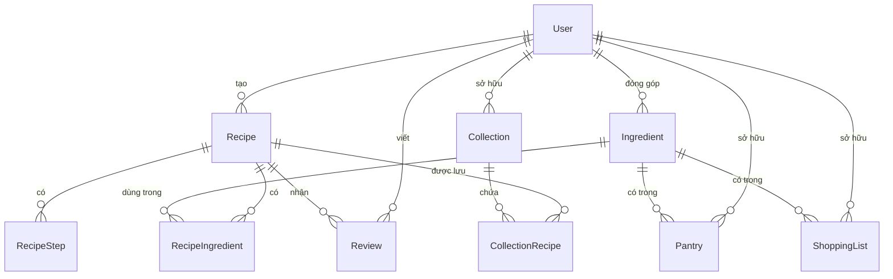
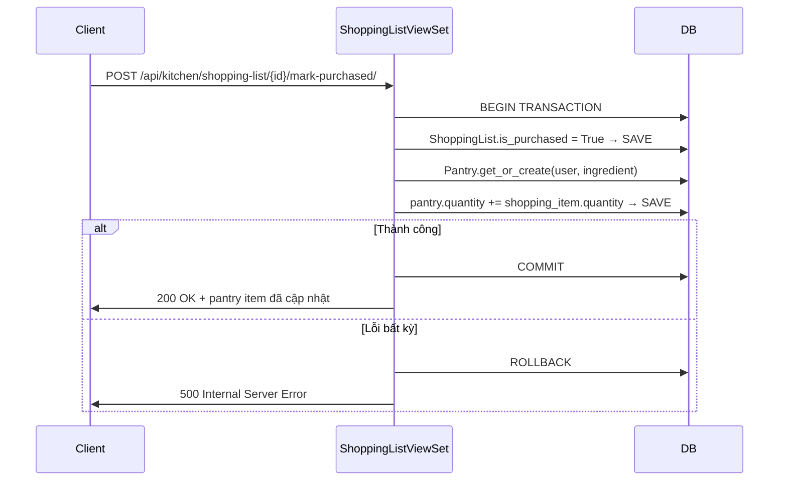
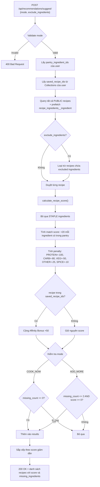

# Tài liệu Thiết kế - Phase 4: API Endpoints

## Tổng quan

Phase 4 xây dựng toàn bộ lớp API cho KitchenMate Backend, bao gồm 7 nhóm endpoint chính. Thiết kế kế thừa trực tiếp từ Models (Phase 2) và hệ thống xác thực JWT (Phase 3), tuân theo kiến trúc Fat Models / Skinny Views với response format nhất quán.

Tất cả API sử dụng:
- **Authentication**: JWT Bearer Token (SimpleJWT)
- **Pagination**: PageNumberPagination, PAGE_SIZE=20
- **Response format**: `{ "success": true/false, "data": ..., "message": ... }`
- **Exception handler**: `core.exceptions.custom_exception_handler`
- **Permissions**: `IsOwnerOrReadOnly`, `IsOwner`, `IsAdminUser` từ `core/permissions.py`

---

## Kiến trúc

```mermaid
graph TD
    Client["Frontend / Client"]

    subgraph "core/"
        URLS["core/urls.py\n(URL Router)"]
        PERMS["core/permissions.py\nIsOwner / IsOwnerOrReadOnly / IsAdminUser"]
        EXC["core/exceptions.py\ncustom_exception_handler"]
    end

    subgraph "apps/accounts/"
        ACC_V["views.py\nMeView, UserPublicProfileView\nUserRecipesView, UserStatsView"]
        ACC_S["serializers.py\nUserSerializer (đã có)"]
    end

    subgraph "apps/ingredients/"
        ING_V["views.py\nIngredientViewSet"]
        ING_S["serializers.py\nIngredientSerializer"]
    end

    subgraph "apps/recipes/"
        REC_V["views.py\nRecipeViewSet"]
        REC_S["serializers.py\nRecipeListSerializer\nRecipeDetailSerializer\nRecipeCreateSerializer"]
        REC_F["filters.py\nRecipeFilter"]
    end

    subgraph "apps/kitchen/"
        KIT_V["views.py\nPantryViewSet\nShoppingListViewSet\nRecommendationView"]
        KIT_S["serializers.py\nPantrySerializer\nShoppingListSerializer"]
        KIT_SVC["services/recommendation_engine.py\ncalculate_recipe_score()\nget_recommendations()"]
    end

    subgraph "apps/social/"
        SOC_V["views.py\nReviewViewSet\nCollectionViewSet"]
        SOC_S["serializers.py\nReviewSerializer\nCollectionSerializer"]
    end

    subgraph "apps/admin_panel/"
        ADM_V["views.py\nAdminRecipeViewSet\nAdminIngredientViewSet\nAdminUserViewSet"]
    end

    Client --> URLS
    URLS --> ACC_V
    URLS --> ING_V
    URLS --> REC_V
    URLS --> KIT_V
    URLS --> SOC_V
    URLS --> ADM_V

    ACC_V --> PERMS
    ING_V --> PERMS
    REC_V --> PERMS
    KIT_V --> PERMS
    SOC_V --> PERMS
    ADM_V --> PERMS

    KIT_V --> KIT_SVC
```



---

## Components và Interfaces

### 4.1 Accounts API — Bổ sung vào `apps/accounts/`

**Các file cần sửa/thêm:**

**`apps/accounts/views.py`** — Thêm 2 view mới:

```python
class UserRecipesView(APIView):
    """GET /api/accounts/{id}/recipes/ — Danh sách công thức PUBLIC của user"""
    permission_classes = [AllowAny]

    def get(self, request, pk):
        user = get_object_or_404(User, pk=pk, is_active=True)
        recipes = Recipe.objects.filter(
            user=user, visibility='PUBLIC'
        ).select_related('user').prefetch_related(
            'recipe_ingredients__ingredient', 'steps'
        )
        page = self.paginate_queryset(recipes)
        # Trả về RecipeListSerializer với pagination

class UserStatsView(APIView):
    """GET /api/accounts/{id}/stats/ — Thống kê hoạt động của user"""
    permission_classes = [AllowAny]

    def get(self, request, pk):
        user = get_object_or_404(User, pk=pk, is_active=True)
        recipe_count = Recipe.objects.filter(user=user, visibility='PUBLIC').count()
        total_saves = CollectionRecipe.objects.filter(
            recipe__user=user
        ).count()
        return Response({'success': True, 'data': {
            'recipe_count': recipe_count,
            'total_saves': total_saves
        }})
```

**`apps/accounts/profile_urls.py`** — Thêm 2 URL pattern:

```python
path('<uuid:pk>/recipes/', UserRecipesView.as_view(), name='user-recipes'),
path('<uuid:pk>/stats/', UserStatsView.as_view(), name='user-stats'),
```

---

### 4.2 Ingredients API — `apps/ingredients/`

**Các file cần tạo mới:**

**`apps/ingredients/serializers.py`**:

```python
class IngredientSerializer(serializers.ModelSerializer):
    class Meta:
        model = Ingredient
        fields = ('id', 'name', 'category', 'status', 'created_by', 'created_at')
        read_only_fields = ('id', 'status', 'created_by', 'created_at')

    def validate_name(self, value):
        # Kiểm tra tên đã tồn tại (case-insensitive)
        if Ingredient.objects.filter(name__iexact=value).exists():
            raise serializers.ValidationError('Nguyên liệu này đã tồn tại trong hệ thống.')
        return value
```

**`apps/ingredients/views.py`**:

```python
class IngredientViewSet(viewsets.GenericViewSet,
                        mixins.ListModelMixin,
                        mixins.CreateModelMixin):
    serializer_class = IngredientSerializer
    filter_backends = [DjangoFilterBackend]
    filterset_fields = ['category']

    def get_queryset(self):
        return Ingredient.objects.filter(status='APPROVED').order_by('name')

    def get_permissions(self):
        if self.action == 'create':
            return [IsAuthenticated()]
        return [AllowAny()]

    def perform_create(self, serializer):
        serializer.save(status='PENDING', created_by=self.request.user)

    @action(detail=False, methods=['get'], url_path='search')
    def search(self, request):
        q = request.query_params.get('q', '').strip()
        if not q:
            return Response({'success': True, 'data': []})
        results = Ingredient.objects.filter(
            name__icontains=q, status='APPROVED'
        )[:10]
        return Response({'success': True, 'data': IngredientSerializer(results, many=True).data})
```

**`apps/ingredients/urls.py`**:

```python
router = DefaultRouter()
router.register(r'', IngredientViewSet, basename='ingredient')
urlpatterns = router.urls
```

---

### 4.3 Recipes API — `apps/recipes/`

**Các file cần tạo mới:**

**`apps/recipes/serializers.py`**:

```python
class RecipeIngredientSerializer(serializers.ModelSerializer):
    ingredient_name = serializers.CharField(source='ingredient.name', read_only=True)
    ingredient_category = serializers.CharField(source='ingredient.category', read_only=True)

    class Meta:
        model = RecipeIngredient
        fields = ('id', 'ingredient', 'ingredient_name', 'ingredient_category', 'quantity', 'unit')

class RecipeStepSerializer(serializers.ModelSerializer):
    class Meta:
        model = RecipeStep
        fields = ('id', 'step_number', 'instruction', 'media_url')

class RecipeListSerializer(serializers.ModelSerializer):
    """Dùng cho list endpoint — ít trường hơn để tối ưu performance"""
    user_name = serializers.CharField(source='user.full_name', read_only=True)

    class Meta:
        model = Recipe
        fields = ('id', 'title', 'description', 'difficulty', 'prep_time',
                  'thumbnail_url', 'visibility', 'user', 'user_name', 'created_at')

class RecipeDetailSerializer(serializers.ModelSerializer):
    """Dùng cho detail endpoint — đầy đủ thông tin"""
    user = UserSerializer(read_only=True)
    recipe_ingredients = RecipeIngredientSerializer(many=True, read_only=True)
    steps = RecipeStepSerializer(many=True, read_only=True)
    avg_rating = serializers.SerializerMethodField()

    def get_avg_rating(self, obj):
        from django.db.models import Avg
        result = obj.reviews.aggregate(avg=Avg('rating'))
        return round(result['avg'], 1) if result['avg'] else None

    class Meta:
        model = Recipe
        fields = ('id', 'title', 'description', 'difficulty', 'prep_time',
                  'thumbnail_url', 'visibility', 'user', 'recipe_ingredients',
                  'steps', 'avg_rating', 'created_at', 'updated_at')

class RecipeCreateSerializer(serializers.ModelSerializer):
    """Dùng cho create/update — nhận nested ingredients và steps"""
    ingredients = RecipeIngredientSerializer(many=True, write_only=True)
    steps = RecipeStepSerializer(many=True, write_only=True)

    class Meta:
        model = Recipe
        fields = ('title', 'description', 'difficulty', 'prep_time',
                  'thumbnail_url', 'ingredients', 'steps')

    def create(self, validated_data):
        ingredients_data = validated_data.pop('ingredients', [])
        steps_data = validated_data.pop('steps', [])
        with transaction.atomic():
            recipe = Recipe.objects.create(**validated_data)
            for ing in ingredients_data:
                RecipeIngredient.objects.create(recipe=recipe, **ing)
            for step in steps_data:
                RecipeStep.objects.create(recipe=recipe, **step)
        return recipe
```

**`apps/recipes/filters.py`**:

```python
class RecipeFilter(django_filters.FilterSet):
    title = django_filters.CharFilter(field_name='title', lookup_expr='icontains')
    difficulty = django_filters.ChoiceFilter(choices=Recipe.Difficulty.choices)

    class Meta:
        model = Recipe
        fields = ['difficulty', 'title']
```

**`apps/recipes/views.py`** — RecipeViewSet với các actions:

| Action | Method | URL | Permission |
|--------|--------|-----|------------|
| `list` | GET | `/api/recipes/` | AllowAny |
| `create` | POST | `/api/recipes/` | IsAuthenticated |
| `retrieve` | GET | `/api/recipes/{id}/` | Custom (owner hoặc PUBLIC) |
| `update` | PUT/PATCH | `/api/recipes/{id}/` | IsOwner + PRIVATE only |
| `destroy` | DELETE | `/api/recipes/{id}/` | IsOwner |
| `my_recipes` | GET | `/api/recipes/my-recipes/` | IsAuthenticated |
| `publish` | POST | `/api/recipes/{id}/publish/` | IsOwner + PRIVATE only |

Logic đặc biệt trong `retrieve`: nếu recipe là PRIVATE/PENDING và request.user != owner → trả về 404 (không phải 403, để tránh lộ thông tin tồn tại).

Logic đặc biệt trong `update`: nếu recipe không phải PRIVATE → trả về 403.

---

### 4.4 Kitchen API — `apps/kitchen/`

**`apps/kitchen/serializers.py`**:

```python
class PantrySerializer(serializers.ModelSerializer):
    ingredient_name = serializers.CharField(source='ingredient.name', read_only=True)
    ingredient_category = serializers.CharField(source='ingredient.category', read_only=True)

    class Meta:
        model = Pantry
        fields = ('id', 'ingredient', 'ingredient_name', 'ingredient_category',
                  'quantity', 'unit', 'updated_at')
        read_only_fields = ('id', 'updated_at')

class ShoppingListSerializer(serializers.ModelSerializer):
    ingredient_name = serializers.CharField(source='ingredient.name', read_only=True)

    class Meta:
        model = ShoppingList
        fields = ('id', 'ingredient', 'ingredient_name', 'quantity', 'unit',
                  'is_purchased', 'created_at')
        read_only_fields = ('id', 'is_purchased', 'created_at')
```

**`apps/kitchen/views.py`** — PantryViewSet và ShoppingListViewSet:

Cả hai ViewSet đều dùng `IsOwner` permission và override `get_queryset()` để filter theo `user=request.user`.

---

### 4.5 Recommendation API — `apps/kitchen/services/`

**`apps/kitchen/services/__init__.py`**: file rỗng

**`apps/kitchen/services/recommendation_engine.py`**:

```python
PENALTY = {
    'PROTEIN': -100,
    'CARB': -80,
    'VEG': -50,
    'OTHER': -25,
    'SPICE': -10,
}

def calculate_recipe_score(recipe, pantry_ingredient_ids, saved_recipe_ids):
    """
    Tính điểm gợi ý cho một công thức dựa trên pantry của user.
    Bỏ qua nguyên liệu STAPLE.
    Trả về (score, missing_ingredients_list).
    """
    score = 0
    missing = []
    for ri in recipe.recipe_ingredients.all():
        if ri.ingredient.category == 'STAPLE':
            continue
        if ri.ingredient_id in pantry_ingredient_ids:
            score += 20
        else:
            score += PENALTY.get(ri.ingredient.category, -25)
            missing.append({
                'id': ri.ingredient_id,
                'name': ri.ingredient.name,
                'category': ri.ingredient.category,
            })
    if recipe.id in saved_recipe_ids:
        score += 50
    return score, missing


def get_recommendations(user, mode, exclude_ingredient_ids=None):
    """
    Lấy danh sách công thức gợi ý theo mode COOK_NOW hoặc ADD_MORE.
    Sử dụng prefetch_related để tránh N+1 query.
    """
    from apps.recipes.models import Recipe
    from apps.social.models import CollectionRecipe

    pantry_ingredient_ids = set(
        user.pantry_items.values_list('ingredient_id', flat=True)
    )
    saved_recipe_ids = set(
        CollectionRecipe.objects.filter(
            collection__user=user
        ).values_list('recipe_id', flat=True)
    )

    recipes = Recipe.objects.filter(
        visibility='PUBLIC'
    ).prefetch_related('recipe_ingredients__ingredient')

    if exclude_ingredient_ids:
        recipes = recipes.exclude(
            recipe_ingredients__ingredient_id__in=exclude_ingredient_ids
        ).distinct()

    results = []
    for recipe in recipes:
        score, missing = calculate_recipe_score(recipe, pantry_ingredient_ids, saved_recipe_ids)
        missing_count = len(missing)

        if mode == 'COOK_NOW' and missing_count == 0:
            results.append({'recipe': recipe, 'score': score, 'missing_ingredients': missing})
        elif mode == 'ADD_MORE' and missing_count <= 2 and score >= 0:
            results.append({'recipe': recipe, 'score': score, 'missing_ingredients': missing})

    results.sort(key=lambda x: x['score'], reverse=True)
    return results
```

**`apps/kitchen/views.py`** — RecommendationView:

```python
class RecommendationView(APIView):
    """POST /api/recommendations/suggest/"""
    permission_classes = [IsAuthenticated]

    def post(self, request):
        mode = request.data.get('mode')
        if mode not in ('COOK_NOW', 'ADD_MORE'):
            return Response(
                {'success': False, 'error': {'message': 'mode phải là COOK_NOW hoặc ADD_MORE.'}},
                status=400
            )
        exclude_ids = request.data.get('exclude_ingredients', [])
        results = get_recommendations(request.user, mode, exclude_ids)
        # Serialize và trả về
```

---

### 4.6 Social API — `apps/social/`

**`apps/social/serializers.py`**:

```python
class ReviewSerializer(serializers.ModelSerializer):
    user_name = serializers.CharField(source='user.full_name', read_only=True)

    class Meta:
        model = Review
        fields = ('id', 'user', 'user_name', 'recipe', 'rating', 'comment',
                  'cooksnap_url', 'created_at')
        read_only_fields = ('id', 'user', 'created_at')

class CollectionRecipeSerializer(serializers.ModelSerializer):
    class Meta:
        model = CollectionRecipe
        fields = ('id', 'recipe', 'added_at')
        read_only_fields = ('id', 'added_at')

class CollectionSerializer(serializers.ModelSerializer):
    collection_recipes = CollectionRecipeSerializer(many=True, read_only=True)
    recipe_count = serializers.IntegerField(
        source='collection_recipes.count', read_only=True
    )

    class Meta:
        model = Collection
        fields = ('id', 'name', 'recipe_count', 'collection_recipes', 'created_at')
        read_only_fields = ('id', 'created_at')
```

**`apps/social/views.py`** — ReviewViewSet và CollectionViewSet:

| ViewSet | Actions |
|---------|---------|
| ReviewViewSet | list (by recipe_id), create, update, partial_update, destroy |
| CollectionViewSet | list, create, destroy, add_recipe, remove_recipe |

URL pattern cho reviews lồng trong recipe: `/api/social/recipes/{recipe_id}/reviews/`

---

### 4.7 Admin API — `apps/admin_panel/`

**Tạo app mới** `apps/admin_panel/` với cấu trúc tối giản:

```
apps/admin_panel/
├── __init__.py
├── apps.py
├── views.py
└── urls.py
```

**`apps/admin_panel/views.py`**:

```python
class AdminRecipeViewSet(viewsets.GenericViewSet):
    permission_classes = [IsAdminUser]

    @action(detail=False, methods=['get'], url_path='pending')
    def pending(self, request):
        recipes = Recipe.objects.filter(
            visibility='PENDING'
        ).select_related('user')
        # Paginate và trả về

    @action(detail=True, methods=['post'])
    def approve(self, request, pk=None):
        recipe = get_object_or_404(Recipe, pk=pk)
        recipe.visibility = 'PUBLIC'
        recipe.save()
        return Response({'success': True, 'message': 'Công thức đã được duyệt.'})

    @action(detail=True, methods=['post'])
    def reject(self, request, pk=None):
        recipe = get_object_or_404(Recipe, pk=pk)
        recipe.visibility = 'PRIVATE'
        recipe.save()
        return Response({'success': True, 'message': 'Công thức đã bị từ chối.'})

class AdminIngredientViewSet(viewsets.GenericViewSet):
    permission_classes = [IsAdminUser]
    # pending, approve, reject tương tự AdminRecipeViewSet

class AdminUserViewSet(viewsets.GenericViewSet):
    permission_classes = [IsAdminUser]
    # list, block (is_active=False), unblock (is_active=True)
```

---

## Data Models

Tóm tắt các model liên quan và quan hệ giữa chúng:



### Các trường quan trọng cho API logic:

| Model | Trường | Ý nghĩa |
|-------|--------|---------|
| Recipe | `visibility` | PRIVATE / PENDING / PUBLIC — kiểm soát quyền truy cập |
| Ingredient | `status` | PENDING / APPROVED / REJECTED — kiểm soát hiển thị |
| Ingredient | `category` | STAPLE bị bỏ qua trong recommendation engine |
| ShoppingList | `is_purchased` | Khi True → trigger atomic transaction cộng vào Pantry |
| User | `is_active` | False → tài khoản bị khóa, không thể đăng nhập |
| User | `is_staff` | True → có quyền truy cập Admin API |

---

## Luồng xử lý Business Logic phức tạp

### Luồng 1: mark_purchased — Atomic Transaction



**Quy tắc quan trọng:**
- Dùng `@transaction.atomic` decorator trên action `mark_purchased`
- Dùng `get_or_create` với `defaults={'quantity': 0, 'unit': item.unit}` để xử lý cả trường hợp pantry item chưa tồn tại
- Cộng dồn `quantity` (không ghi đè) để tích lũy số lượng đã mua

### Luồng 2: Recommendation Engine — Tier-3 Scoring



---

## Cấu trúc file cần tạo/sửa

### Files cần SỬA:

```
apps/accounts/views.py          — Thêm UserRecipesView, UserStatsView
apps/accounts/profile_urls.py   — Thêm 2 URL pattern mới
core/urls.py                    — Uncomment và thêm URL patterns mới
core/settings.py                — Thêm 'apps.admin_panel' vào INSTALLED_APPS
```

### Files cần TẠO MỚI:

```
apps/ingredients/serializers.py
apps/ingredients/urls.py

apps/recipes/serializers.py
apps/recipes/filters.py
apps/recipes/urls.py

apps/kitchen/serializers.py
apps/kitchen/urls.py
apps/kitchen/services/__init__.py
apps/kitchen/services/recommendation_engine.py

apps/social/serializers.py
apps/social/urls.py

apps/admin_panel/__init__.py
apps/admin_panel/apps.py
apps/admin_panel/views.py
apps/admin_panel/urls.py
```

### Files cần ĐIỀN NỘI DUNG (hiện đang trống):

```
apps/ingredients/views.py
apps/recipes/views.py
apps/kitchen/views.py
apps/social/views.py
```

---

## Correctness Properties

*Một property là đặc tính hoặc hành vi phải đúng trong mọi lần thực thi hợp lệ của hệ thống — về cơ bản là một phát biểu hình thức về những gì hệ thống phải làm. Properties là cầu nối giữa đặc tả dạng ngôn ngữ tự nhiên và đảm bảo tính đúng đắn có thể kiểm chứng tự động.*

### Property 1: Profile update round-trip

*Với bất kỳ* dữ liệu profile hợp lệ nào (full_name, avatar_url, bio), sau khi PATCH `/api/accounts/me/`, GET lại phải trả về đúng dữ liệu đó.

**Validates: Requirements 1.2**

### Property 2: User recipes chỉ trả về PUBLIC

*Với bất kỳ* user nào có tập hợp công thức với các visibility khác nhau, GET `/api/accounts/{id}/recipes/` phải chỉ trả về các công thức có `visibility=PUBLIC`.

**Validates: Requirements 1.6**

### Property 3: User stats recipe_count khớp thực tế

*Với bất kỳ* user nào, `recipe_count` trong stats phải bằng đúng số lượng công thức PUBLIC của user đó trong database.

**Validates: Requirements 1.7**

### Property 4: Ingredients list chỉ trả về APPROVED

*Với bất kỳ* tập hợp ingredients nào trong database, GET `/api/ingredients/` phải chỉ trả về các ingredients có `status=APPROVED`.

**Validates: Requirements 2.1**

### Property 5: Search ingredients — kết quả phải APPROVED và chứa keyword

*Với bất kỳ* keyword tìm kiếm nào, tất cả kết quả từ `/api/ingredients/search/?q={keyword}` phải có `status=APPROVED` và `name` chứa keyword (case-insensitive).

**Validates: Requirements 2.2**

### Property 6: Ingredient mới tạo có status=PENDING

*Với bất kỳ* name và category hợp lệ nào, ingredient được tạo qua POST `/api/ingredients/` phải có `status=PENDING` và `created_by` bằng user đang đăng nhập.

**Validates: Requirements 2.4**

### Property 7: Recipes list chỉ trả về PUBLIC

*Với bất kỳ* tập hợp recipes nào trong database, GET `/api/recipes/` phải chỉ trả về các recipes có `visibility=PUBLIC`.

**Validates: Requirements 3.1**

### Property 8: Recipe mới tạo có visibility=PRIVATE

*Với bất kỳ* recipe data hợp lệ nào, recipe được tạo qua POST `/api/recipes/` phải có `visibility=PRIVATE` và `user` bằng user đang đăng nhập.

**Validates: Requirements 3.2**

### Property 9: PRIVATE recipe chỉ owner mới xem được

*Với bất kỳ* PRIVATE recipe nào, GET `/api/recipes/{id}/` từ user không phải owner phải trả về 404.

**Validates: Requirements 3.5, 3.6**

### Property 10: my-recipes trả về tất cả recipes của user

*Với bất kỳ* user nào, tất cả kết quả từ GET `/api/recipes/my-recipes/` phải có `user` bằng user đang đăng nhập, bao gồm mọi visibility.

**Validates: Requirements 3.12**

### Property 11: Publish chuyển PRIVATE sang PENDING

*Với bất kỳ* PRIVATE recipe nào, sau khi POST `/api/recipes/{id}/publish/`, recipe phải có `visibility=PENDING`.

**Validates: Requirements 3.13**

### Property 12: Pantry data isolation giữa users

*Với bất kỳ* user nào, GET `/api/kitchen/pantry/` phải chỉ trả về các Pantry items có `user` bằng user đang đăng nhập, không lẫn dữ liệu của user khác.

**Validates: Requirements 4.1**

### Property 13: mark_purchased cộng dồn đúng vào Pantry

*Với bất kỳ* ShoppingList item nào, sau khi POST mark-purchased thành công: `is_purchased=True` VÀ Pantry item tương ứng có `quantity` tăng đúng bằng `quantity` của shopping item.

**Validates: Requirements 4.9**

### Property 14: COOK_NOW chỉ trả về recipes có đủ nguyên liệu

*Với bất kỳ* trạng thái pantry nào, tất cả kết quả từ POST `/api/recommendations/suggest/` với `mode=COOK_NOW` phải có `missing_ingredients` rỗng (missing_count = 0).

**Validates: Requirements 5.1**

### Property 15: ADD_MORE thỏa mãn điều kiện missing và score

*Với bất kỳ* trạng thái pantry nào, tất cả kết quả từ POST `/api/recommendations/suggest/` với `mode=ADD_MORE` phải có `len(missing_ingredients) <= 2` VÀ `score >= 0`.

**Validates: Requirements 5.2**

### Property 16: STAPLE ingredients không ảnh hưởng đến score

*Với bất kỳ* recipe nào, thêm hoặc bỏ STAPLE ingredients khỏi recipe không được thay đổi score tính toán từ `calculate_recipe_score()`.

**Validates: Requirements 5.3**

### Property 17: Scoring algorithm đúng theo công thức

*Với bất kỳ* recipe và pantry state nào, score phải bằng tổng của: (+20 × số non-STAPLE ingredients có trong pantry) + (penalty × số non-STAPLE ingredients thiếu) + (50 nếu recipe trong saved collection).

**Validates: Requirements 5.4, 5.5, 5.6**

### Property 18: exclude_ingredients loại trừ đúng

*Với bất kỳ* danh sách exclude_ingredients nào, không có kết quả nào trong response chứa bất kỳ ingredient nào trong danh sách đó.

**Validates: Requirements 5.7**

### Property 19: Reviews list thuộc đúng recipe

*Với bất kỳ* recipe_id nào, tất cả kết quả từ GET `/api/social/recipes/{recipe_id}/reviews/` phải có `recipe` bằng recipe_id đó.

**Validates: Requirements 6.1**

### Property 20: Collection data isolation giữa users

*Với bất kỳ* user nào, GET `/api/social/collections/` phải chỉ trả về Collections có `user` bằng user đang đăng nhập.

**Validates: Requirements 6.8**

### Property 21: Response format nhất quán

*Với bất kỳ* request thành công nào đến bất kỳ endpoint nào, response phải có `success=true` và trường `data` chứa payload.

**Validates: Requirements 8.1**

### Property 22: Pagination fields đầy đủ

*Với bất kỳ* list endpoint nào, response phải có `data.count`, `data.next`, `data.previous`, và `data.results`.

**Validates: Requirements 8.3**

---

## Error Handling

### Nguyên tắc chung

Tất cả lỗi được xử lý qua `core/exceptions.py` — `custom_exception_handler` đảm bảo format nhất quán:

```json
{
  "success": false,
  "error": {
    "message": "Mô tả lỗi ngắn gọn",
    "details": { "field": ["chi tiết lỗi"] }
  }
}
```

### Bảng HTTP Status Codes

| Tình huống | Status Code |
|-----------|-------------|
| Thành công (tạo mới) | 201 Created |
| Thành công (các action khác) | 200 OK |
| Xóa thành công | 204 No Content |
| Validation error | 400 Bad Request |
| Chưa xác thực | 401 Unauthorized |
| Không có quyền | 403 Forbidden |
| Không tìm thấy | 404 Not Found |
| Lỗi server | 500 Internal Server Error |

### Các lỗi đặc thù

| Endpoint | Lỗi | Xử lý |
|----------|-----|-------|
| `POST /api/ingredients/` | Tên đã tồn tại | Validate trong serializer, trả về 400 |
| `GET /api/recipes/{id}/` | PRIVATE + non-owner | Trả về 404 (không phải 403) |
| `PUT/PATCH /api/recipes/{id}/` | Recipe không phải PRIVATE | Trả về 403 |
| `POST mark-purchased` | Transaction lỗi | Rollback + trả về 500 |
| `POST /api/recommendations/suggest/` | mode không hợp lệ | Trả về 400 |
| `POST /api/social/reviews/` | Đã review rồi | IntegrityError → 400 |

---

## Testing Strategy

### Phân loại test

**Unit tests** — kiểm tra logic cụ thể:
- Serializer validation (tên ingredient trùng, rating ngoài 1-5, title rỗng)
- Permission checks (owner vs non-owner, staff vs regular user)
- State transition logic (PRIVATE → PENDING khi publish)
- Response format cho từng endpoint

**Property-based tests** — kiểm tra tính đúng đắn tổng quát:
- Sử dụng thư viện `hypothesis` (Python)
- Mỗi property test chạy tối thiểu 100 iterations
- Tag format: `# Feature: phase-4-api-endpoints, Property {N}: {mô tả}`

**Integration tests** — kiểm tra luồng end-to-end:
- mark_purchased atomic transaction (thành công và rollback)
- Recommendation engine với dữ liệu thực tế
- Admin approve/reject workflow

### Ưu tiên test

1. **Cao nhất**: mark_purchased transaction (Property 13) — business critical
2. **Cao**: Recommendation engine scoring (Properties 14-18) — core feature
3. **Trung bình**: Data isolation (Properties 12, 20) — security
4. **Bình thường**: Response format và pagination (Properties 21, 22)

### Cấu hình Hypothesis

```python
from hypothesis import given, settings, strategies as st

@settings(max_examples=100)
@given(st.text(min_size=1, max_size=200))  # Ví dụ cho recipe title
def test_recipe_created_as_private(title):
    # Feature: phase-4-api-endpoints, Property 8: Recipe mới tạo có visibility=PRIVATE
    ...
```
