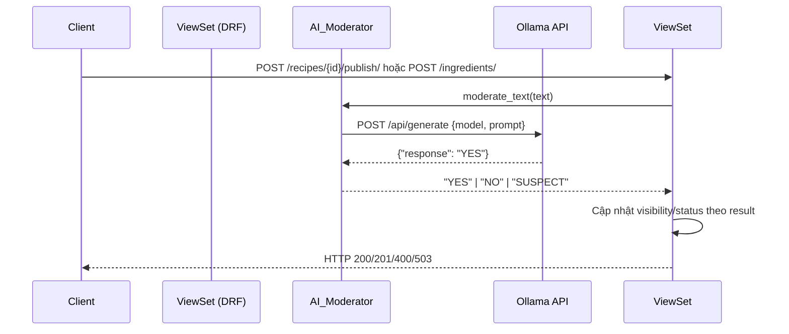
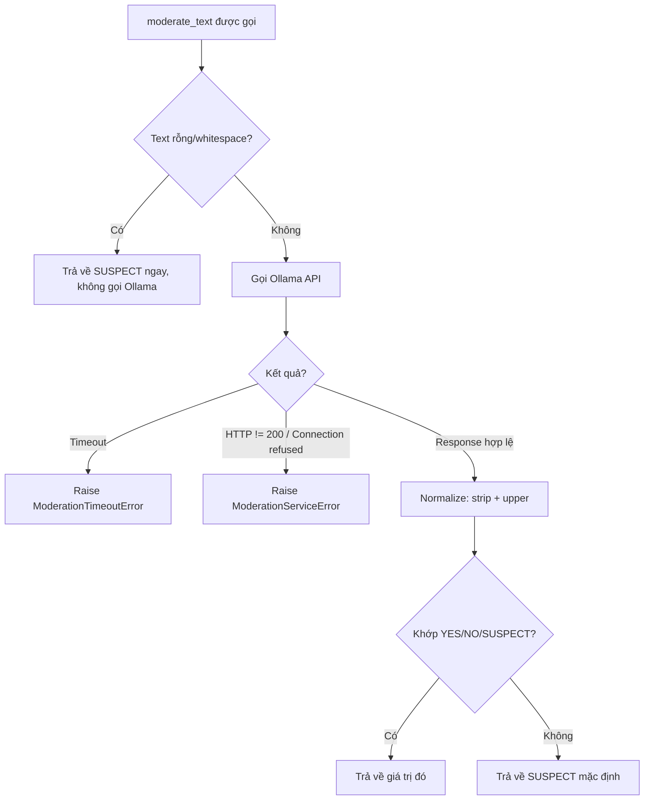

# Design Document — Phase 5: AI Moderation

## Overview

Phase 5 bổ sung lớp kiểm duyệt nội dung tự động bằng AI vào hệ thống KitchenMate Backend. Thay vì để Admin duyệt thủ công toàn bộ nội dung, hệ thống sẽ gọi Local LLM (model `gemma4:e2b` chạy qua Ollama) để phân tích văn bản và phân loại mức độ phù hợp trước khi lưu vào database.

Hai điểm tích hợp chính:
- `RecipeViewSet.publish()` — kiểm duyệt công thức trước khi công khai
- `IngredientViewSet.create()` — kiểm duyệt tên nguyên liệu trước khi lưu

Kết quả kiểm duyệt (`YES` / `NO` / `SUSPECT`) quyết định trực tiếp trạng thái cuối cùng của đối tượng và HTTP response trả về client.

---

## Architecture

### Luồng xử lý tổng quan



### Luồng xử lý lỗi



### Vị trí trong project

```
KitchenMate_Backend/
├── core/
│   ├── settings.py          ← Thêm OLLAMA_BASE_URL, OLLAMA_MODEL, OLLAMA_TIMEOUT
│   └── services/
│       └── ai_moderator.py  ← Module mới (NEW)
├── apps/
│   ├── recipes/
│   │   └── views.py         ← Sửa publish() action
│   └── ingredients/
│       └── views.py         ← Sửa create() và perform_create()
```

---

## Components and Interfaces

### 1. `core/services/ai_moderator.py`

Module trung tâm, chịu trách nhiệm toàn bộ giao tiếp với Ollama.

**Public interface:**

```python
# Exception classes
class ModerationTimeoutError(Exception): ...
class ModerationServiceError(Exception): ...

# Hàm chính
def moderate_text(text: str) -> str:
    """
    Nhận văn bản, trả về "YES", "NO", hoặc "SUSPECT".
    Không bao giờ raise exception ra ngoài (ngoại trừ ModerationTimeoutError
    và ModerationServiceError khi Ollama không khả dụng).
    """
```

**Internal helpers:**

```python
def _build_prompt(text: str) -> str:
    """Nhúng text vào Prompt_Template tiếng Việt."""

def _call_ollama(prompt: str) -> str:
    """Gọi HTTP POST tới Ollama, trả về raw response text."""

def _normalize_result(raw: str) -> str:
    """Strip whitespace, upper, validate — fallback về SUSPECT."""
```

### 2. `RecipeViewSet.publish()` — cập nhật logic

Thay thế logic hiện tại (chuyển thẳng sang PENDING) bằng luồng AI moderation:

| Moderation Result | Hành động | HTTP Response |
|---|---|---|
| `YES` | `recipe.visibility = "PUBLIC"` | 200 + thông báo thành công |
| `NO` | Không lưu | 400 + thông báo vi phạm |
| `SUSPECT` | `recipe.visibility = "PENDING"` | 200 + thông báo chờ duyệt |
| Exception | Không lưu | 503 + thông báo service lỗi |

### 3. `IngredientViewSet.create()` — cập nhật logic

Thay thế `perform_create()` hiện tại (lưu thẳng với PENDING) bằng luồng AI moderation:

| Moderation Result | Hành động | HTTP Response |
|---|---|---|
| `YES` | Lưu với `status = "APPROVED"` | 201 + thông báo thành công |
| `NO` | Không lưu | 400 + thông báo vi phạm |
| `SUSPECT` | Lưu với `status = "PENDING"` | 201 + thông báo chờ duyệt |
| Exception | Lưu với `status = "PENDING"` | 201 + thông báo chờ duyệt |

> **Lưu ý thiết kế:** Ingredient khi AI lỗi vẫn được lưu với PENDING (graceful degradation) để không làm gián đoạn trải nghiệm người dùng. Recipe thì trả về 503 vì publish là hành động chủ động hơn và người dùng có thể thử lại.

---

## Data Models

Không có thay đổi schema database. Phase 5 chỉ thay đổi **giá trị** được gán cho các trường đã tồn tại:

### Recipe.visibility
```
PRIVATE  → (publish + YES)  → PUBLIC
PRIVATE  → (publish + SUSPECT) → PENDING
PRIVATE  → (publish + NO)   → PRIVATE (không thay đổi)
PRIVATE  → (publish + error) → PRIVATE (không thay đổi)
```

### Ingredient.status
```
(create + YES)     → APPROVED
(create + SUSPECT) → PENDING
(create + NO)      → Không tạo
(create + error)   → PENDING
```

### Cấu hình mới trong `settings.py`

```python
# Thay thế AI_MODEL_NAME và AI_API_URL hiện tại
OLLAMA_BASE_URL = os.getenv('OLLAMA_BASE_URL', 'http://localhost:11434')
OLLAMA_MODEL    = os.getenv('OLLAMA_MODEL', 'gemma4:e2b')
OLLAMA_TIMEOUT  = int(os.getenv('OLLAMA_TIMEOUT', 30))
```

### Prompt Template

```
Bạn là hệ thống kiểm duyệt nội dung cho nền tảng chia sẻ công thức nấu ăn.
Hãy đánh giá văn bản sau và trả lời bằng ĐÚNG MỘT trong ba từ: YES, NO, hoặc SUSPECT.

Tiêu chí:
- YES: Nội dung phù hợp với chủ đề ẩm thực, không vi phạm cộng đồng.
- NO: Nội dung rõ ràng không phù hợp (ngôn từ thô tục, nội dung độc hại, hoàn toàn không liên quan đến ẩm thực).
- SUSPECT: Nội dung mơ hồ, cần Admin xem xét thêm.

Chỉ trả về đúng một từ, không giải thích, không thêm ký tự nào khác.

Văn bản cần kiểm duyệt:
{text}
```

---

## Correctness Properties

*A property is a characteristic or behavior that should hold true across all valid executions of a system — essentially, a formal statement about what the system should do. Properties serve as the bridge between human-readable specifications and machine-verifiable correctness guarantees.*

### Property 1: Text nhúng vào prompt

*For any* chuỗi văn bản hợp lệ (non-empty, non-whitespace), khi `moderate_text` được gọi, chuỗi đó phải xuất hiện nguyên vẹn trong prompt được gửi tới Ollama API.

**Validates: Requirements 2.4**

---

### Property 2: Output luôn là giá trị hợp lệ

*For any* văn bản hợp lệ và bất kỳ response hợp lệ nào từ Ollama (`"YES"`, `"NO"`, `"SUSPECT"` với các biến thể whitespace/case), `moderate_text` phải trả về đúng một trong ba giá trị chuẩn hóa: `"YES"`, `"NO"`, hoặc `"SUSPECT"`.

**Validates: Requirements 3.2, 3.3**

---

### Property 3: Fallback về SUSPECT cho response không hợp lệ

*For any* chuỗi response từ Ollama mà sau khi strip và upper không khớp với `"YES"`, `"NO"`, hoặc `"SUSPECT"`, `moderate_text` phải trả về `"SUSPECT"`.

**Validates: Requirements 3.4**

---

### Property 4: Whitespace input không gọi Ollama

*For any* chuỗi chỉ chứa whitespace (bao gồm chuỗi rỗng, chỉ spaces, chỉ tabs, mixed whitespace), `moderate_text` phải trả về `"SUSPECT"` mà không thực hiện bất kỳ HTTP call nào tới Ollama.

**Validates: Requirements 3.5**

---

### Property 5: Recipe publish — visibility được cập nhật đúng theo moderation result

*For any* recipe có `visibility == "PRIVATE"`, khi `publish()` được gọi:
- Nếu `moderate_text` trả về `"YES"` → `recipe.visibility` phải là `"PUBLIC"` và response là HTTP 200
- Nếu `moderate_text` trả về `"NO"` → `recipe.visibility` vẫn là `"PRIVATE"` và response là HTTP 400
- Nếu `moderate_text` trả về `"SUSPECT"` → `recipe.visibility` phải là `"PENDING"` và response là HTTP 200

**Validates: Requirements 4.2, 4.3, 4.4**

---

### Property 6: Recipe publish — text ghép đúng format và đầy đủ

*For any* recipe có N steps, text được truyền vào `moderate_text` phải chứa `title`, `description`, và tất cả N `instruction` của các steps theo đúng thứ tự `step_number`, ngăn cách bởi `\n`.

**Validates: Requirements 4.1, 4.6**

---

### Property 7: Recipe publish — AI service lỗi không thay đổi trạng thái

*For any* recipe có `visibility == "PRIVATE"`, khi `moderate_text` raise `ModerationTimeoutError` hoặc `ModerationServiceError`, `recipe.visibility` phải giữ nguyên `"PRIVATE"` và response phải là HTTP 503.

**Validates: Requirements 4.5**

---

### Property 8: Ingredient create — status được gán đúng theo moderation result

*For any* ingredient name hợp lệ, khi `create()` được gọi:
- Nếu `moderate_text` trả về `"YES"` → ingredient được lưu với `status = "APPROVED"` và response là HTTP 201
- Nếu `moderate_text` trả về `"NO"` → không có ingredient nào được tạo và response là HTTP 400
- Nếu `moderate_text` trả về `"SUSPECT"` → ingredient được lưu với `status = "PENDING"` và response là HTTP 201

**Validates: Requirements 5.2, 5.3, 5.4**

---

### Property 9: Ingredient create — AI service lỗi vẫn lưu với PENDING

*For any* ingredient name hợp lệ, khi `moderate_text` raise `ModerationTimeoutError` hoặc `ModerationServiceError`, ingredient phải được lưu với `status = "PENDING"` và response phải là HTTP 201.

**Validates: Requirements 5.5**

---

### Property 10: Settings override — AI_Moderator sử dụng giá trị từ Django settings

*For any* giá trị hợp lệ của `OLLAMA_BASE_URL`, `OLLAMA_MODEL`, và `OLLAMA_TIMEOUT` được cấu hình trong Django settings, `AI_Moderator` phải sử dụng đúng các giá trị đó (URL endpoint, model name trong payload, timeout value) thay vì hardcode.

**Validates: Requirements 7.1, 7.2, 7.3, 7.4**

---

## Error Handling

### Exception Hierarchy

```python
Exception
├── ModerationTimeoutError   # Ollama không phản hồi trong timeout
└── ModerationServiceError   # HTTP error, connection refused, parse error
```

### Bảng xử lý lỗi

| Tình huống | Exception | Recipe publish | Ingredient create |
|---|---|---|---|
| Ollama timeout (>30s) | `ModerationTimeoutError` | HTTP 503, không lưu | HTTP 201, lưu PENDING |
| HTTP status != 200 | `ModerationServiceError` | HTTP 503, không lưu | HTTP 201, lưu PENDING |
| Connection refused | `ModerationServiceError` | HTTP 503, không lưu | HTTP 201, lưu PENDING |
| Response không parse được | `ModerationServiceError` | HTTP 503, không lưu | HTTP 201, lưu PENDING |
| Response không hợp lệ | Không raise, fallback SUSPECT | Lưu PENDING | Lưu PENDING |
| Text rỗng/whitespace | Không raise, trả về SUSPECT | Lưu PENDING | Lưu PENDING |

### Logging

Tất cả lỗi phải được log ở mức `ERROR` trước khi raise exception:

```python
import logging
logger = logging.getLogger(__name__)

# Ví dụ:
logger.error("Ollama timeout sau %ds: %s", timeout, str(e))
logger.error("Ollama service error (HTTP %d): %s", response.status_code, response.text)
logger.error("Connection refused tới Ollama: %s", str(e))
```

---

## Testing Strategy

### Thư viện sử dụng

- **Property-based testing**: `hypothesis` (đã có trong project, thấy `.hypothesis/` directory)
- **Unit testing**: `pytest` + `pytest-django`
- **Mocking**: `unittest.mock` (patch `requests.post`)

### Cấu trúc test

```
KitchenMate_Backend/
└── tests/
    ├── test_ai_moderator.py        ← Unit + property tests cho core/services/ai_moderator.py
    ├── test_recipe_publish.py      ← Tests cho RecipeViewSet.publish() với AI
    └── test_ingredient_create.py   ← Tests cho IngredientViewSet.create() với AI
```

### Unit Tests (example-based)

**`test_ai_moderator.py`:**
- Smoke: `ModerationTimeoutError` và `ModerationServiceError` kế thừa từ `Exception`
- Smoke: Hàm `moderate_text` tồn tại và có thể gọi được
- Example: Timeout → raise `ModerationTimeoutError`
- Example: HTTP 500 → raise `ModerationServiceError`
- Example: Connection refused → raise `ModerationServiceError`
- Example: Response `"yes\n"` → trả về `"YES"` (normalize)
- Example: Response `"  No  "` → trả về `"NO"` (normalize)
- Example: Logger.error được gọi khi có exception

**`test_recipe_publish.py`:**
- Example: Recipe không phải PRIVATE → 400 (không gọi AI)
- Example: Recipe không tồn tại → 404

**`test_ingredient_create.py`:**
- Example: Dữ liệu không hợp lệ → 400 (không gọi AI)

### Property Tests (Hypothesis)

Mỗi property test chạy tối thiểu **100 iterations**. Tag format: `# Feature: phase-5-ai-moderation, Property {N}: {mô tả}`

**Property 1 — Text nhúng vào prompt:**
```python
@given(text=st.text(min_size=1).filter(lambda t: t.strip()))
@settings(max_examples=100)
def test_text_embedded_in_prompt(text):
    # Feature: phase-5-ai-moderation, Property 1: Text nhúng vào prompt
    with patch('requests.post') as mock_post:
        mock_post.return_value.status_code = 200
        mock_post.return_value.json.return_value = {'response': 'YES'}
        moderate_text(text)
        call_args = mock_post.call_args
        assert text in call_args[1]['json']['prompt']
```

**Property 2 — Output luôn là giá trị hợp lệ:**
```python
@given(
    text=st.text(min_size=1).filter(lambda t: t.strip()),
    raw_result=st.sampled_from(['YES', 'NO', 'SUSPECT', 'yes', 'no', 'suspect', ' YES ', '\nNO\n'])
)
@settings(max_examples=100)
def test_output_always_valid(text, raw_result):
    # Feature: phase-5-ai-moderation, Property 2: Output luôn là giá trị hợp lệ
    with patch('requests.post') as mock_post:
        mock_post.return_value.status_code = 200
        mock_post.return_value.json.return_value = {'response': raw_result}
        result = moderate_text(text)
        assert result in ('YES', 'NO', 'SUSPECT')
```

**Property 3 — Fallback SUSPECT cho response không hợp lệ:**
```python
@given(
    text=st.text(min_size=1).filter(lambda t: t.strip()),
    invalid_response=st.text().filter(lambda r: r.strip().upper() not in ('YES', 'NO', 'SUSPECT'))
)
@settings(max_examples=100)
def test_invalid_response_fallback_suspect(text, invalid_response):
    # Feature: phase-5-ai-moderation, Property 3: Fallback về SUSPECT cho response không hợp lệ
    with patch('requests.post') as mock_post:
        mock_post.return_value.status_code = 200
        mock_post.return_value.json.return_value = {'response': invalid_response}
        result = moderate_text(text)
        assert result == 'SUSPECT'
```

**Property 4 — Whitespace input không gọi Ollama:**
```python
@given(text=st.one_of(st.just(''), st.text(alphabet=' \t\n\r', min_size=1)))
@settings(max_examples=100)
def test_whitespace_no_api_call(text):
    # Feature: phase-5-ai-moderation, Property 4: Whitespace input không gọi Ollama
    with patch('requests.post') as mock_post:
        result = moderate_text(text)
        assert result == 'SUSPECT'
        mock_post.assert_not_called()
```

**Property 5 — Recipe publish visibility đúng theo result:**
```python
@given(moderation_result=st.sampled_from(['YES', 'NO', 'SUSPECT']))
@settings(max_examples=100)
def test_recipe_publish_visibility(moderation_result, api_client, recipe_factory):
    # Feature: phase-5-ai-moderation, Property 5: Recipe publish visibility đúng theo result
    recipe = recipe_factory(visibility='PRIVATE')
    with patch('core.services.ai_moderator.moderate_text', return_value=moderation_result):
        response = api_client.post(f'/api/recipes/{recipe.id}/publish/')
    expected_visibility = {'YES': 'PUBLIC', 'NO': 'PRIVATE', 'SUSPECT': 'PENDING'}
    expected_status = {'YES': 200, 'NO': 400, 'SUSPECT': 200}
    recipe.refresh_from_db()
    assert recipe.visibility == expected_visibility[moderation_result]
    assert response.status_code == expected_status[moderation_result]
```

**Property 6 — Recipe text ghép đúng format:**
```python
@given(steps=st.lists(st.text(min_size=1), min_size=0, max_size=10))
@settings(max_examples=100)
def test_recipe_text_format(steps, api_client, recipe_factory):
    # Feature: phase-5-ai-moderation, Property 6: Recipe text ghép đúng format
    recipe = recipe_factory(visibility='PRIVATE', steps=steps)
    captured_text = []
    def capture(text): captured_text.append(text); return 'YES'
    with patch('core.services.ai_moderator.moderate_text', side_effect=capture):
        api_client.post(f'/api/recipes/{recipe.id}/publish/')
    text = captured_text[0]
    assert recipe.title in text
    assert recipe.description in text
    for instruction in steps:
        assert instruction in text
```

**Property 7 — Recipe publish AI lỗi không thay đổi trạng thái:**
```python
@given(exc_class=st.sampled_from([ModerationTimeoutError, ModerationServiceError]))
@settings(max_examples=100)
def test_recipe_publish_ai_error(exc_class, api_client, recipe_factory):
    # Feature: phase-5-ai-moderation, Property 7: AI service lỗi không thay đổi trạng thái recipe
    recipe = recipe_factory(visibility='PRIVATE')
    with patch('core.services.ai_moderator.moderate_text', side_effect=exc_class('error')):
        response = api_client.post(f'/api/recipes/{recipe.id}/publish/')
    recipe.refresh_from_db()
    assert recipe.visibility == 'PRIVATE'
    assert response.status_code == 503
```

**Property 8 — Ingredient create status đúng theo result:**
```python
@given(moderation_result=st.sampled_from(['YES', 'NO', 'SUSPECT']))
@settings(max_examples=100)
def test_ingredient_create_status(moderation_result, api_client, user_factory):
    # Feature: phase-5-ai-moderation, Property 8: Ingredient create status đúng theo result
    with patch('core.services.ai_moderator.moderate_text', return_value=moderation_result):
        response = api_client.post('/api/ingredients/', {'name': 'Nguyên liệu test', 'category': 'OTHER'})
    expected_status_code = {'YES': 201, 'NO': 400, 'SUSPECT': 201}
    expected_ing_status = {'YES': 'APPROVED', 'NO': None, 'SUSPECT': 'PENDING'}
    assert response.status_code == expected_status_code[moderation_result]
    if moderation_result != 'NO':
        ing = Ingredient.objects.get(name='Nguyên liệu test')
        assert ing.status == expected_ing_status[moderation_result]
```

**Property 9 — Ingredient create AI lỗi vẫn lưu PENDING:**
```python
@given(exc_class=st.sampled_from([ModerationTimeoutError, ModerationServiceError]))
@settings(max_examples=100)
def test_ingredient_create_ai_error(exc_class, api_client):
    # Feature: phase-5-ai-moderation, Property 9: AI service lỗi vẫn lưu ingredient với PENDING
    with patch('core.services.ai_moderator.moderate_text', side_effect=exc_class('error')):
        response = api_client.post('/api/ingredients/', {'name': 'Nguyên liệu lỗi', 'category': 'OTHER'})
    assert response.status_code == 201
    ing = Ingredient.objects.get(name='Nguyên liệu lỗi')
    assert ing.status == 'PENDING'
```

**Property 10 — Settings override:**
```python
@given(
    base_url=st.from_regex(r'http://[\w.]+:\d+', fullmatch=True),
    model=st.text(min_size=1, alphabet=st.characters(whitelist_categories=('Lu', 'Ll', 'Nd'), whitelist_characters=':.-_')),
    timeout=st.integers(min_value=1, max_value=120)
)
@settings(max_examples=100)
def test_settings_override(base_url, model, timeout):
    # Feature: phase-5-ai-moderation, Property 10: Settings override
    with override_settings(OLLAMA_BASE_URL=base_url, OLLAMA_MODEL=model, OLLAMA_TIMEOUT=timeout):
        with patch('requests.post') as mock_post:
            mock_post.return_value.status_code = 200
            mock_post.return_value.json.return_value = {'response': 'YES'}
            moderate_text('test text')
            call_args = mock_post.call_args
            assert call_args[0][0].startswith(base_url)
            assert call_args[1]['json']['model'] == model
            assert call_args[1]['timeout'] == timeout
```

### Dual Testing Approach

- **Unit tests** bắt các lỗi cụ thể: timeout, HTTP error, connection refused, logging
- **Property tests** đảm bảo tính đúng đắn tổng quát: với mọi input hợp lệ, behavior luôn nhất quán
- Cả hai bổ sung cho nhau — unit tests nhanh và rõ ràng, property tests tìm edge cases không ngờ tới
