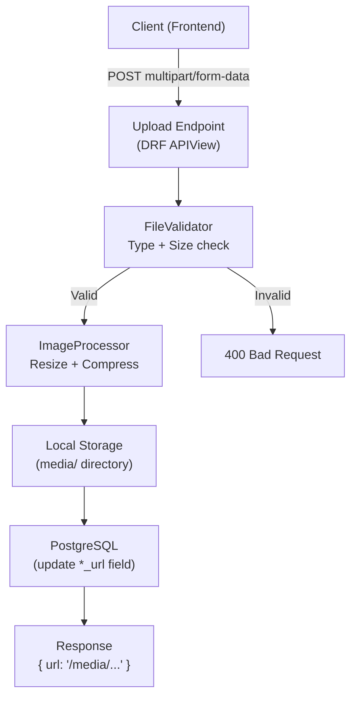
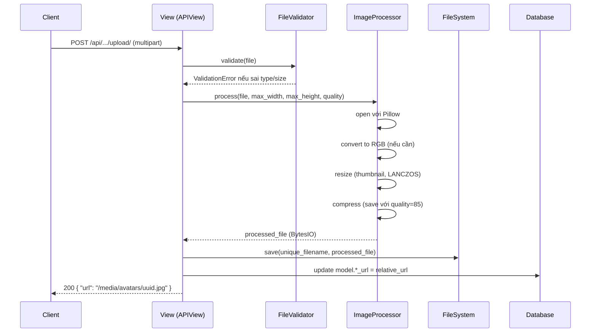
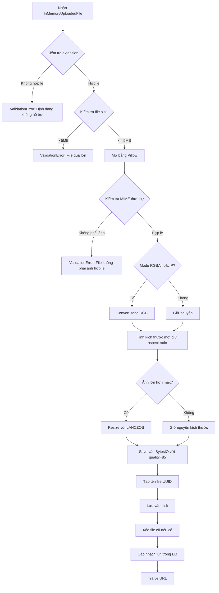

# Design Document: Phase 8 — File Upload & Media Handling

## Tổng quan

Phase 8 xây dựng hệ thống upload và xử lý ảnh cho KitchenMate Backend. Hệ thống cung cấp các dedicated upload endpoints riêng biệt cho từng loại media (avatar, recipe thumbnail, recipe step media, cooksnap), xử lý ảnh (resize/compress) trước khi lưu, validate file type và size, và tổ chức file theo cấu trúc thư mục rõ ràng. Các trường `avatar_url`, `thumbnail_url`, `media_url`, `cooksnap_url` trong models hiện tại **không thay đổi schema** — chỉ được cập nhật giá trị URL sau khi upload thành công.

---

## Kiến trúc tổng thể



### Luồng xử lý chi tiết



---

## Cấu trúc thư mục Media

```
media/
├── avatars/                    # User avatar
│   └── {uuid}.jpg
├── recipes/
│   ├── thumbnails/             # Recipe thumbnail
│   │   └── {uuid}.jpg
│   └── steps/                  # RecipeStep media
│       └── {uuid}.jpg
└── cooksnaps/                  # Review cooksnap
    └── {uuid}.jpg
```

**Quy tắc đặt tên file:**
- Tất cả file được đổi tên thành `{uuid4}.{ext}` khi lưu
- Extension được chuẩn hóa: `jpeg` → `jpg`, `webp` → `webp`
- Đảm bảo không bao giờ trùng tên file

---

## Components và Interfaces

### Component 1: FileValidator

**Mục đích:** Validate file upload trước khi xử lý

**Interface:**

```python
class FileValidator:
    ALLOWED_TYPES: set[str] = {'image/jpeg', 'image/png', 'image/webp'}
    ALLOWED_EXTENSIONS: set[str] = {'jpg', 'jpeg', 'png', 'webp'}
    MAX_FILE_SIZE: int = 5 * 1024 * 1024  # 5MB

    def validate(self, file: InMemoryUploadedFile) -> None:
        """
        Raises ValidationError nếu file không hợp lệ.
        Kiểm tra: extension, MIME type (magic bytes), file size.
        """
        ...

    def _check_extension(self, filename: str) -> None: ...
    def _check_mime_type(self, file: InMemoryUploadedFile) -> None: ...
    def _check_file_size(self, file: InMemoryUploadedFile) -> None: ...
```

**Trách nhiệm:**
- Kiểm tra extension của filename (whitelist: jpg, jpeg, png, webp)
- Kiểm tra MIME type thực sự bằng magic bytes qua Pillow (không tin vào Content-Type header)
- Kiểm tra file size ≤ 5MB
- Raise `ValidationError` với message tiếng Việt rõ ràng

---

### Component 2: ImageProcessor

**Mục đích:** Resize và compress ảnh trước khi lưu

**Interface:**

```python
class ImageProcessor:
    def process(
        self,
        file: InMemoryUploadedFile,
        max_width: int,
        max_height: int,
        quality: int = 85,
        output_format: str = 'JPEG'
    ) -> BytesIO:
        """
        Resize ảnh về max_width x max_height (giữ aspect ratio),
        convert sang RGB nếu cần, compress với quality.
        Trả về BytesIO chứa ảnh đã xử lý.
        """
        ...

    def _get_resize_dimensions(
        self,
        original_width: int,
        original_height: int,
        max_width: int,
        max_height: int
    ) -> tuple[int, int]:
        """Tính kích thước mới giữ nguyên aspect ratio."""
        ...
```

**Kích thước chuẩn theo loại:**

| Loại | max_width | max_height | quality |
|------|-----------|------------|---------|
| Avatar | 400 | 400 | 85 |
| Recipe Thumbnail | 800 | 600 | 85 |
| Recipe Step Media | 1200 | 900 | 80 |
| Cooksnap | 1200 | 900 | 80 |

---

### Component 3: MediaUploadService

**Mục đích:** Orchestrate toàn bộ luồng upload — validate → process → save → update DB

**Interface:**

```python
class MediaUploadService:
    def upload_avatar(
        self,
        user: User,
        file: InMemoryUploadedFile
    ) -> str:
        """
        Upload avatar cho user. Xóa file cũ nếu tồn tại.
        Trả về relative URL: '/media/avatars/{uuid}.jpg'
        """
        ...

    def upload_recipe_thumbnail(
        self,
        recipe: Recipe,
        file: InMemoryUploadedFile
    ) -> str:
        """
        Upload thumbnail cho recipe. Xóa file cũ nếu tồn tại.
        Trả về relative URL: '/media/recipes/thumbnails/{uuid}.jpg'
        """
        ...

    def upload_step_media(
        self,
        step: RecipeStep,
        file: InMemoryUploadedFile
    ) -> str:
        """
        Upload media cho recipe step. Xóa file cũ nếu tồn tại.
        Trả về relative URL: '/media/recipes/steps/{uuid}.jpg'
        """
        ...

    def upload_cooksnap(
        self,
        review: Review,
        file: InMemoryUploadedFile
    ) -> str:
        """
        Upload cooksnap cho review. Xóa file cũ nếu tồn tại.
        Trả về relative URL: '/media/cooksnaps/{uuid}.jpg'
        """
        ...

    def _delete_old_file(self, url: str | None) -> None:
        """Xóa file cũ trên disk nếu URL tồn tại và file tồn tại."""
        ...

    def _generate_unique_filename(self, ext: str) -> str:
        """Tạo tên file unique dạng {uuid4}.{ext}"""
        ...
```

---

### Component 4: Upload Views (APIView)

**Mục đích:** Xử lý HTTP request/response cho upload endpoints

```python
class AvatarUploadView(APIView):
    permission_classes = [IsAuthenticated]
    parser_classes = [MultiPartParser, FormParser]

    def post(self, request) -> Response:
        """POST /api/accounts/me/avatar/"""
        ...

class RecipeThumbnailUploadView(APIView):
    permission_classes = [IsAuthenticated]
    parser_classes = [MultiPartParser, FormParser]

    def post(self, request, recipe_id) -> Response:
        """POST /api/recipes/{recipe_id}/thumbnail/"""
        # Kiểm tra recipe thuộc về request.user
        ...

class RecipeStepMediaUploadView(APIView):
    permission_classes = [IsAuthenticated]
    parser_classes = [MultiPartParser, FormParser]

    def post(self, request, recipe_id, step_id) -> Response:
        """POST /api/recipes/{recipe_id}/steps/{step_id}/media/"""
        # Kiểm tra recipe thuộc về request.user
        ...

class CooksnapUploadView(APIView):
    permission_classes = [IsAuthenticated]
    parser_classes = [MultiPartParser, FormParser]

    def post(self, request, review_id) -> Response:
        """POST /api/social/reviews/{review_id}/cooksnap/"""
        # Kiểm tra review thuộc về request.user
        ...
```

---

## API Endpoints

### 8.1 Upload Avatar

```
POST /api/accounts/me/avatar/
Authorization: Bearer {token}
Content-Type: multipart/form-data

Body:
  file: <image file>

Response 200:
{
  "url": "/media/avatars/550e8400-e29b-41d4-a716-446655440000.jpg",
  "message": "Cập nhật avatar thành công"
}

Response 400:
{
  "error": "Định dạng file không được hỗ trợ. Chỉ chấp nhận: jpg, png, webp"
}
```

### 8.2 Upload Recipe Thumbnail

```
POST /api/recipes/{recipe_id}/thumbnail/
Authorization: Bearer {token}
Content-Type: multipart/form-data

Body:
  file: <image file>

Response 200:
{
  "url": "/media/recipes/thumbnails/550e8400-e29b-41d4-a716-446655440000.jpg",
  "message": "Cập nhật thumbnail thành công"
}

Response 403:
{
  "error": "Bạn không có quyền chỉnh sửa công thức này"
}
```

### 8.3 Upload Recipe Step Media

```
POST /api/recipes/{recipe_id}/steps/{step_id}/media/
Authorization: Bearer {token}
Content-Type: multipart/form-data

Body:
  file: <image file>

Response 200:
{
  "url": "/media/recipes/steps/550e8400-e29b-41d4-a716-446655440000.jpg",
  "message": "Cập nhật ảnh bước thực hiện thành công"
}
```

### 8.4 Upload Cooksnap

```
POST /api/social/reviews/{review_id}/cooksnap/
Authorization: Bearer {token}
Content-Type: multipart/form-data

Body:
  file: <image file>

Response 200:
{
  "url": "/media/cooksnaps/550e8400-e29b-41d4-a716-446655440000.jpg",
  "message": "Cập nhật cooksnap thành công"
}
```

---

## Data Models (Không thay đổi schema)

Các fields hiện tại vẫn là `TextField`, chỉ được cập nhật giá trị:

```python
# accounts/models.py — KHÔNG THAY ĐỔI
avatar_url = models.TextField(blank=True, null=True)
# Giá trị sau upload: "/media/avatars/{uuid}.jpg"

# recipes/models.py — KHÔNG THAY ĐỔI
thumbnail_url = models.TextField(blank=True, null=True)
# Giá trị sau upload: "/media/recipes/thumbnails/{uuid}.jpg"

media_url = models.TextField(blank=True, null=True)
# Giá trị sau upload: "/media/recipes/steps/{uuid}.jpg"

# social/models.py — KHÔNG THAY ĐỔI
cooksnap_url = models.TextField(blank=True, null=True)
# Giá trị sau upload: "/media/cooksnaps/{uuid}.jpg"
```

---

## Cấu trúc file trong project

```
KitchenMate_Backend/
├── core/
│   └── utils/
│       ├── __init__.py
│       ├── file_validator.py       # FileValidator class
│       ├── image_processor.py      # ImageProcessor class
│       └── media_upload_service.py # MediaUploadService class
├── apps/
│   ├── accounts/
│   │   ├── upload_views.py         # AvatarUploadView
│   │   └── upload_urls.py          # URL patterns cho avatar upload
│   ├── recipes/
│   │   ├── upload_views.py         # RecipeThumbnailUploadView, RecipeStepMediaUploadView
│   │   └── upload_urls.py          # URL patterns cho recipe upload
│   └── social/
│       ├── upload_views.py         # CooksnapUploadView
│       └── upload_urls.py          # URL patterns cho cooksnap upload
└── media/                          # Tạo tự động
    ├── avatars/
    ├── recipes/
    │   ├── thumbnails/
    │   └── steps/
    └── cooksnaps/
```

---

## Image Processing Pipeline (Chi tiết)



---

## Error Handling

### Scenario 1: File type không hợp lệ
- **Điều kiện:** Extension không phải jpg/jpeg/png/webp, hoặc magic bytes không khớp
- **Response:** `400 Bad Request` — `"Định dạng file không được hỗ trợ. Chỉ chấp nhận: jpg, png, webp"`
- **Recovery:** Client thử lại với file đúng định dạng

### Scenario 2: File quá lớn
- **Điều kiện:** File size > 5MB
- **Response:** `400 Bad Request` — `"File quá lớn. Kích thước tối đa là 5MB"`
- **Recovery:** Client compress ảnh trước khi upload

### Scenario 3: Không có file trong request
- **Điều kiện:** Request không có field `file`
- **Response:** `400 Bad Request` — `"Vui lòng chọn file để upload"`
- **Recovery:** Client đính kèm file vào request

### Scenario 4: Permission denied
- **Điều kiện:** User cố upload thumbnail cho recipe của người khác
- **Response:** `403 Forbidden` — `"Bạn không có quyền chỉnh sửa công thức này"`
- **Recovery:** Client kiểm tra ownership trước khi gọi API

### Scenario 5: Lỗi I/O khi lưu file
- **Điều kiện:** Disk full hoặc permission error trên server
- **Response:** `500 Internal Server Error` — `"Không thể lưu file. Vui lòng thử lại sau"`
- **Recovery:** Server log lỗi, không cập nhật DB

---

## Correctness Properties (Property-Based Testing với Hypothesis)

### Property 1: Validate file type — reject tất cả extension không hợp lệ

```python
@given(
    filename=st.text(
        alphabet=st.characters(whitelist_categories=('Lu', 'Ll', 'Nd')),
        min_size=1, max_size=20
    ).filter(lambda s: not s.lower().endswith(('jpg', 'jpeg', 'png', 'webp')))
)
def test_invalid_extension_always_rejected(filename):
    """
    ∀ filename có extension không thuộc {jpg, jpeg, png, webp}
    → FileValidator.validate() phải raise ValidationError
    """
    validator = FileValidator()
    fake_file = create_fake_file(filename + ".gif")
    with pytest.raises(ValidationError):
        validator._check_extension(fake_file.name)
```

### Property 2: Validate file size — reject tất cả file > 5MB

```python
@given(size=st.integers(min_value=5 * 1024 * 1024 + 1, max_value=50 * 1024 * 1024))
def test_oversized_file_always_rejected(size):
    """
    ∀ file_size > 5MB → FileValidator phải raise ValidationError
    """
    validator = FileValidator()
    fake_file = create_fake_file_with_size(size)
    with pytest.raises(ValidationError):
        validator._check_file_size(fake_file)
```

### Property 3: Validate file size — chấp nhận tất cả file <= 5MB

```python
@given(size=st.integers(min_value=1, max_value=5 * 1024 * 1024))
def test_valid_size_always_accepted(size):
    """
    ∀ file_size ∈ [1, 5MB] → FileValidator._check_file_size() không raise exception
    """
    validator = FileValidator()
    fake_file = create_fake_file_with_size(size)
    # Không raise exception
    validator._check_file_size(fake_file)
```

### Property 4: Image resize — output không bao giờ vượt quá max dimensions

```python
@given(
    width=st.integers(min_value=1, max_value=5000),
    height=st.integers(min_value=1, max_value=5000),
    max_w=st.integers(min_value=100, max_value=2000),
    max_h=st.integers(min_value=100, max_value=2000),
)
def test_resize_never_exceeds_max_dimensions(width, height, max_w, max_h):
    """
    ∀ (width, height, max_w, max_h):
    output_w <= max_w AND output_h <= max_h
    """
    processor = ImageProcessor()
    out_w, out_h = processor._get_resize_dimensions(width, height, max_w, max_h)
    assert out_w <= max_w
    assert out_h <= max_h
```

### Property 5: Image resize — giữ nguyên aspect ratio

```python
@given(
    width=st.integers(min_value=2, max_value=5000),
    height=st.integers(min_value=2, max_value=5000),
    max_w=st.integers(min_value=100, max_value=2000),
    max_h=st.integers(min_value=100, max_value=2000),
)
def test_resize_preserves_aspect_ratio(width, height, max_w, max_h):
    """
    ∀ (width, height) cần resize:
    |out_w/out_h - width/height| < epsilon (sai số làm tròn pixel)
    """
    processor = ImageProcessor()
    out_w, out_h = processor._get_resize_dimensions(width, height, max_w, max_h)
    original_ratio = width / height
    output_ratio = out_w / out_h
    assert abs(original_ratio - output_ratio) < 0.02  # sai số 2% do làm tròn pixel
```

### Property 6: Unique filename — không bao giờ trùng

```python
@given(
    ext=st.sampled_from(['jpg', 'png', 'webp']),
    n=st.integers(min_value=2, max_value=100)
)
def test_generated_filenames_are_unique(ext, n):
    """
    ∀ n lần gọi _generate_unique_filename(ext):
    tất cả n tên file phải khác nhau
    """
    service = MediaUploadService()
    filenames = [service._generate_unique_filename(ext) for _ in range(n)]
    assert len(filenames) == len(set(filenames))
```

### Property 7: Ảnh nhỏ hơn max không bị phóng to

```python
@given(
    width=st.integers(min_value=1, max_value=399),
    height=st.integers(min_value=1, max_value=399),
)
def test_small_image_not_upscaled(width, height):
    """
    ∀ ảnh có width < max_width AND height < max_height:
    output dimensions == input dimensions (không phóng to)
    """
    processor = ImageProcessor()
    out_w, out_h = processor._get_resize_dimensions(width, height, 400, 400)
    assert out_w == width
    assert out_h == height
```

---

## Testing Strategy

### Unit Testing

- `FileValidator`: Test từng method riêng lẻ với các input hợp lệ/không hợp lệ
- `ImageProcessor._get_resize_dimensions()`: Test logic tính toán kích thước
- `MediaUploadService._generate_unique_filename()`: Test format UUID
- `MediaUploadService._delete_old_file()`: Test xóa file với mock filesystem

### Property-Based Testing (Hypothesis)

- Sử dụng thư viện `hypothesis` (đã có trong requirements.txt)
- 7 properties được định nghĩa ở trên
- Tập trung vào: validation boundaries, resize correctness, uniqueness

### Integration Testing

- Test toàn bộ luồng upload qua HTTP với `APIClient` của DRF
- Test permission: user A không upload được cho recipe của user B
- Test cleanup: file cũ bị xóa sau khi upload file mới
- Test response format: URL trả về có thể GET được

### Performance Considerations

- Xử lý ảnh đồng bộ (synchronous) trong request cycle — chấp nhận được vì max 5MB
- Nếu cần async trong tương lai: dùng Celery task
- Pillow LANCZOS resampling: chất lượng cao, tốc độ chấp nhận được với ảnh ≤ 5MB

---

## Security Considerations

- **Không tin vào Content-Type header**: Luôn verify bằng Pillow (magic bytes)
- **Đổi tên file**: Không bao giờ dùng tên file gốc từ client (tránh path traversal)
- **Giới hạn size**: Validate trước khi đọc toàn bộ file vào memory
- **Chỉ serve media trong DEBUG**: `static()` URL pattern chỉ active khi `DEBUG=True`
- **Production**: Dùng Nginx/S3 để serve media, không qua Django

---

## Dependencies

- `Pillow==10.4.0` — đã có trong requirements.txt
- `hypothesis==6.131.18` — đã có trong requirements.txt (cho property tests)
- `pytest-django==4.12.0` — đã có trong requirements.txt
- Không cần thêm package mới cho local storage
- (Optional) `django-storages` + `boto3` cho AWS S3 production
