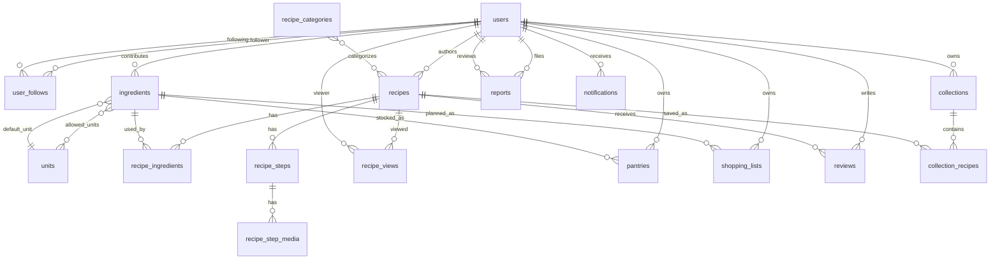

# KitchenMate Backend — Database Schema

## Nguồn xác minh

Tài liệu này mô tả schema hiện tại của các app nghiệp vụ trong backend KitchenMate.

Đã kiểm chứng bằng:

```powershell
cd KitchenMate_Backend
.\venv\Scripts\python.exe manage.py makemigrations --check --dry-run
.\venv\Scripts\python.exe manage.py showmigrations accounts ingredients recipes kitchen social reports
```

Kết quả tại thời điểm cập nhật:

- `makemigrations --check --dry-run`: `No changes detected`.
- Tất cả migration của `accounts`, `ingredients`, `recipes`, `kitchen`, `social`, và `reports` đã applied.
- Field, choices, indexes, constraints được đối chiếu với `apps/*/models.py` và Django runtime metadata.

Database dùng PostgreSQL. Project không dùng SQLite cho môi trường phát triển.

---

## ERD nghiệp vụ



ERD này chỉ gồm bảng nghiệp vụ. Django và third-party apps còn tạo các bảng hệ thống như `auth_group`, `auth_permission`, `django_session`, `django_migrations`, và bảng token blacklist của Simple JWT.

---

## Quy ước

- `UUID PK`: khóa chính dạng UUID.
- `BigAuto PK`: khóa chính `BigAutoField`.
- `FK ... CASCADE`: xóa bản ghi cha sẽ xóa bản ghi con.
- `FK ... SET_NULL`: xóa bản ghi cha sẽ set khóa ngoại thành `NULL`.
- `FK ... PROTECT`: không cho xóa bản ghi cha nếu còn bản ghi con tham chiếu.
- `M2M`: quan hệ many-to-many do Django tạo bảng trung gian.

---

## Tổng quan bảng

| App | Bảng |
| --- | --- |
| `accounts` | `users`, `user_follows` |
| `ingredients` | `units`, `ingredients`, `ingredients_allowed_units` |
| `recipes` | `recipe_categories`, `recipes`, `recipes_categories`, `recipe_views`, `recipe_ingredients`, `recipe_steps`, `recipe_step_media` |
| `kitchen` | `pantries`, `shopping_lists` |
| `social` | `reviews`, `collections`, `collection_recipes` |
| `reports` | `reports`, `notifications` |

---

## accounts

### `users`

Model: `accounts.User`. Kế thừa `AbstractUser`; `AUTH_USER_MODEL = 'accounts.User'`.

Mô tả bảng: Lưu tài khoản KitchenMate, thông tin đăng nhập, hồ sơ cơ bản, trạng thái khóa tài khoản, quyền admin, và thông tin liên kết Google OAuth.

| Cột | Kiểu / ràng buộc | Mô tả |
| --- | --- | --- |
| `id` | UUID PK | Khóa chính user. |
| `password` | `CharField(128)` | Hash mật khẩu từ Django auth. |
| `last_login` | `DateTimeField`, nullable | Lần đăng nhập gần nhất. |
| `is_superuser` | `BooleanField`, default `False` | Quyền superuser Django. |
| `username` | `CharField(150)`, unique | Field kế thừa từ `AbstractUser`; vẫn tồn tại trong DB. |
| `first_name` | `CharField(150)`, blank | Field kế thừa từ `AbstractUser`. |
| `last_name` | `CharField(150)`, blank | Field kế thừa từ `AbstractUser`. |
| `is_staff` | `BooleanField`, default `False` | Có quyền vào Django admin/admin API tùy permission. |
| `is_active` | `BooleanField`, default `True` | `False` dùng để khóa tài khoản. |
| `date_joined` | `DateTimeField` | Field kế thừa từ `AbstractUser`. |
| `email` | `EmailField(254)`, unique | Trường đăng nhập chính (`USERNAME_FIELD`). |
| `full_name` | `CharField(100)` | Tên hiển thị đầy đủ. |
| `avatar_url` | `TextField`, nullable, blank | URL/path ảnh đại diện. |
| `bio` | `TextField`, nullable, blank | Giới thiệu cá nhân. |
| `created_at` | `DateTimeField`, auto add | Thời điểm tạo theo app. |
| `google_user_id` | `CharField(255)`, unique, nullable, blank | Google OAuth `sub` claim. |
| `is_google_user` | `BooleanField`, default `False` | Đã đăng nhập bằng Google ít nhất một lần. |

Django tạo thêm:

- `users_groups`: M2M `users` <-> `auth_group`.
- `users_user_permissions`: M2M `users` <-> `auth_permission`.

### `user_follows`

Model: `accounts.UserFollow`.

Mô tả bảng: Lưu quan hệ theo dõi giữa hai user để phục vụ follower/following, thống kê hồ sơ, và các luồng social.

| Cột | Kiểu / ràng buộc | Mô tả |
| --- | --- | --- |
| `id` | BigAuto PK | Khóa chính. |
| `follower_id` | FK -> `users`, CASCADE | Người theo dõi. |
| `following_id` | FK -> `users`, CASCADE | Người được theo dõi. |
| `created_at` | `DateTimeField`, auto add | Thời điểm bắt đầu theo dõi. |

Constraints và indexes:

- Unique: `(follower_id, following_id)`, name `unique_user_follow_relation`.
- Check: `follower_id != following_id`, name `prevent_self_follow`.
- Index `user_follow_followe_2723af_idx`: `(follower_id, created_at)`.
- Index `user_follow_followi_27587c_idx`: `(following_id, created_at)`.

---

## ingredients

### `units`

Model: `ingredients.Unit`.

Mô tả bảng: Lưu danh mục đơn vị đo lường có thể quản trị, dùng làm đơn vị mặc định hoặc đơn vị hợp lệ cho nguyên liệu.

| Cột | Kiểu / ràng buộc | Mô tả |
| --- | --- | --- |
| `id` | BigAuto PK | Khóa chính. |
| `name` | `CharField(50)` | Tên đơn vị hiển thị. |
| `slug` | `SlugField(20)`, unique | Mã đơn vị ổn định. |
| `is_active` | `BooleanField`, default `True` | Soft delete đơn vị. |

Ordering: `name`.

`Unit.delete()` không hard-delete; method này set `is_active=False`.

### `ingredients`

Model: `ingredients.Ingredient`.

Mô tả bảng: Lưu danh mục nguyên liệu dùng chung toàn hệ thống, bao gồm phân loại, trạng thái kiểm duyệt, đơn vị liên quan, soft delete, và thông tin người đóng góp.

| Cột | Kiểu / ràng buộc | Mô tả |
| --- | --- | --- |
| `id` | BigAuto PK | Khóa chính. |
| `name` | `CharField(100)`, unique | Tên nguyên liệu. |
| `category` | `CharField(20)`, choices, default `OTHER` | Nhóm nguyên liệu. |
| `status` | `CharField(20)`, choices, default `APPROVED` | Trạng thái kiểm duyệt. |
| `created_by_id` | FK -> `users`, SET_NULL, nullable, blank | Người đóng góp nguyên liệu. |
| `created_at` | `DateTimeField`, auto add | Thời điểm tạo. |
| `is_deleted` | `BooleanField`, default `False` | Soft delete nguyên liệu. |
| `deleted_at` | `DateTimeField`, nullable, blank | Thời điểm soft delete. |
| `default_unit_id` | FK -> `units`, SET_NULL, nullable, blank | Đơn vị mặc định. |
| `rejection_reason` | `TextField`, nullable, blank | Lý do từ chối. |

M2M:

- `allowed_units`: M2M -> `units`, through table `ingredients_allowed_units`.

Choices `category`: `PROTEIN`, `CARB`, `VEG`, `SPICE`, `STAPLE`, `OTHER`.

Choices `status`: `PENDING`, `APPROVED`, `REJECTED`.

Ordering: `name`.

### `ingredients_allowed_units`

Model: Django-generated through model `ingredients.Ingredient_allowed_units`.

Mô tả bảng: Lưu tập đơn vị đo được phép dùng cho từng nguyên liệu, giúp UI/API chỉ cho chọn các đơn vị phù hợp theo từng ingredient.

| Cột | Kiểu / ràng buộc | Mô tả |
| --- | --- | --- |
| `id` | BigAuto PK | Khóa chính. |
| `ingredient_id` | FK -> `ingredients`, CASCADE | Nguyên liệu được cấu hình đơn vị hợp lệ. |
| `unit_id` | FK -> `units`, CASCADE | Đơn vị được phép dùng cho nguyên liệu. |

Unique: `(ingredient_id, unit_id)`.

---

## recipes

### `recipe_categories`

Model: `recipes.RecipeCategory`.

Mô tả bảng: Lưu danh mục phân loại công thức, thứ tự hiển thị, trạng thái active, và slug dùng cho quản trị danh mục.

| Cột | Kiểu / ràng buộc | Mô tả |
| --- | --- | --- |
| `id` | UUID PK | Khóa chính. |
| `name` | `CharField(100)`, unique | Tên danh mục. |
| `slug` | `SlugField(100)`, unique, blank | Mã danh mục; tự sinh từ `name` nếu chưa có. |
| `description` | `TextField`, blank, default `''` | Mô tả. |
| `order` | `IntegerField`, default `0` | Thứ tự hiển thị. |
| `is_active` | `BooleanField`, default `True` | Soft delete danh mục. |
| `created_at` | `DateTimeField`, auto add | Thời điểm tạo. |
| `updated_at` | `DateTimeField`, auto update | Thời điểm cập nhật. |

Ordering: `order`, `name`.

### `recipes`

Model: `recipes.Recipe`. Manager mặc định lọc `is_deleted=False`.

Mô tả bảng: Lưu thông tin tổng quan của công thức nấu ăn, chủ sở hữu, trạng thái hiển thị, trạng thái AI moderation, thống kê lượt xem, và trạng thái xóa mềm.

| Cột | Kiểu / ràng buộc | Mô tả |
| --- | --- | --- |
| `id` | UUID PK | Khóa chính. |
| `user_id` | FK -> `users`, CASCADE | Tác giả công thức. |
| `title` | `CharField(200)` | Tên công thức. |
| `description` | `TextField`, blank | Mô tả. |
| `prep_time` | `IntegerField`, min `1`, nullable, blank | Thời gian chuẩn bị/nấu, tính bằng phút. |
| `difficulty` | `CharField(10)`, choices, default `EASY` | Độ khó. |
| `visibility` | `CharField(10)`, choices, default `PRIVATE` | Trạng thái hiển thị. |
| `thumbnail_url` | `TextField`, nullable, blank | URL/path ảnh đại diện. |
| `view_count` | `PositiveIntegerField`, default `0` | Tổng lượt xem. |
| `created_at` | `DateTimeField`, auto add | Thời điểm tạo. |
| `updated_at` | `DateTimeField`, auto update | Thời điểm cập nhật. |
| `is_deleted` | `BooleanField`, default `False` | Soft delete công thức. |
| `deleted_at` | `DateTimeField`, nullable, blank | Thời điểm đưa vào trash. |
| `rejection_reason` | `TextField`, nullable, blank | Lý do từ chối publish. |
| `has_invalid_ingredients` | `BooleanField`, default `False` | Có nguyên liệu không hợp lệ khi kiểm tra. |
| `ai_moderation_attempted` | `BooleanField`, default `False` | Đã từng gọi AI moderation. |
| `ai_moderation_status` | `CharField(20)`, choices, default `PENDING` | Trạng thái AI moderation. |

M2M:

- `categories`: M2M -> `recipe_categories`, through table `recipes_categories`.

Choices:

- `difficulty`: `EASY`, `MEDIUM`, `HARD`.
- `visibility`: `PRIVATE`, `PENDING`, `PUBLIC`.
- `ai_moderation_status`: `PENDING`, `PROCESSING`, `APPROVED`, `REJECTED`.

Ordering: `-created_at`.

`Recipe.TRASH_RETENTION_DAYS = 14`; property `is_expired` kiểm tra thời hạn trash.

### `recipes_categories`

Model: Django-generated through model `recipes.Recipe_categories`.

Mô tả bảng: Lưu quan hệ nhiều-nhiều giữa công thức và danh mục công thức, cho phép một recipe thuộc nhiều category.

| Cột | Kiểu / ràng buộc | Mô tả |
| --- | --- | --- |
| `id` | BigAuto PK | Khóa chính. |
| `recipe_id` | FK -> `recipes`, CASCADE | Công thức được gán danh mục. |
| `recipecategory_id` | FK -> `recipe_categories`, CASCADE | Danh mục được gán cho công thức. |

Unique: `(recipe_id, recipecategory_id)`.

### `recipe_views`

Model: `recipes.RecipeView`.

Mô tả bảng: Lưu từng sự kiện xem công thức để phục vụ analytics theo thời gian; lượt xem có thể gắn với user hoặc anonymous.

| Cột | Kiểu / ràng buộc | Mô tả |
| --- | --- | --- |
| `id` | BigAuto PK | Khóa chính. |
| `recipe_id` | FK -> `recipes`, CASCADE | Công thức được xem. |
| `viewed_at` | `DateTimeField`, auto add | Thời điểm xem. |
| `user_id` | FK -> `users`, SET_NULL, nullable, blank | User xem công thức nếu đã đăng nhập. |

Indexes:

- `recipe_view_recipe__6fc001_idx`: `(recipe_id, -viewed_at)`.
- `recipe_view_viewed__0ee4a9_idx`: `(-viewed_at)`.

### `recipe_ingredients`

Model: `recipes.RecipeIngredient`.

Mô tả bảng: Lưu danh sách nguyên liệu và định lượng của từng công thức; đây là bảng nghiệp vụ chính cho matching nguyên liệu và gợi ý món ăn.

| Cột | Kiểu / ràng buộc | Mô tả |
| --- | --- | --- |
| `id` | BigAuto PK | Khóa chính. |
| `recipe_id` | FK -> `recipes`, CASCADE | Công thức. |
| `ingredient_id` | FK -> `ingredients`, PROTECT | Nguyên liệu. |
| `quantity` | `FloatField`, min `0` | Số lượng. |
| `unit` | `CharField(20)` | Đơn vị lưu trong công thức. |

`ingredient_id` dùng `PROTECT`, nên không thể xóa nguyên liệu đang được công thức tham chiếu.

### `recipe_steps`

Model: `recipes.RecipeStep`.

Mô tả bảng: Lưu các bước thực hiện của công thức theo thứ tự, kèm nội dung hướng dẫn và media minh họa nếu có.

| Cột | Kiểu / ràng buộc | Mô tả |
| --- | --- | --- |
| `id` | BigAuto PK | Khóa chính. |
| `recipe_id` | FK -> `recipes`, CASCADE | Công thức. |
| `step_number` | `IntegerField`, min `1` | Số thứ tự bước. |
| `instruction` | `TextField` | Nội dung hướng dẫn. |
| `media_url` | `TextField`, nullable, blank | URL/path ảnh hoặc video minh họa. |

Ordering: `step_number`.

### `recipe_step_media`

Model: `recipes.RecipeStepMedia`.

Mô tả bảng: Lưu nhiều ảnh hoặc video minh họa cho từng bước nấu ăn. Bảng này mở rộng `recipe_steps.media_url`; field `media_url` trên step vẫn được giữ để tương thích với client cũ và trỏ tới media đầu tiên.

| Cột | Kiểu / ràng buộc | Mô tả |
| --- | --- | --- |
| `id` | BigAuto PK | Khóa chính. |
| `step_id` | FK -> `recipe_steps`, CASCADE | Bước nấu sở hữu media. |
| `media_url` | `TextField` | URL/path ảnh hoặc video. |
| `media_type` | `CharField(10)`, choices | Loại media. |
| `order` | `PositiveIntegerField`, default `1` | Thứ tự hiển thị trong step. |
| `original_name` | `CharField(255)`, blank, default `''` | Tên file gốc do user upload. |
| `created_at` | `DateTimeField`, auto add | Thời điểm upload. |

Choices `media_type`: `IMAGE`, `VIDEO`.

Ordering: `step`, `order`, `created_at`.

---

## kitchen

### `pantries`

Model: `kitchen.Pantry`.

Mô tả bảng: Lưu nguyên liệu hiện có trong tủ lạnh số của từng user, gồm số lượng, đơn vị, và thời điểm cập nhật gần nhất.

| Cột | Kiểu / ràng buộc | Mô tả |
| --- | --- | --- |
| `id` | BigAuto PK | Khóa chính. |
| `user_id` | FK -> `users`, CASCADE | Chủ tủ lạnh. |
| `ingredient_id` | FK -> `ingredients`, CASCADE | Nguyên liệu đang có. |
| `quantity` | `FloatField`, min `0` | Số lượng hiện có. |
| `unit` | `CharField(20)` | Đơn vị. |
| `updated_at` | `DateTimeField`, auto update | Lần cập nhật gần nhất. |

Unique: `(user_id, ingredient_id)`.

Ordering: `ingredient__name`.

### `shopping_lists`

Model: `kitchen.ShoppingList`.

Mô tả bảng: Lưu danh sách nguyên liệu cần mua của từng user và trạng thái đã mua để đồng bộ sang tủ lạnh bằng transaction.

| Cột | Kiểu / ràng buộc | Mô tả |
| --- | --- | --- |
| `id` | BigAuto PK | Khóa chính. |
| `user_id` | FK -> `users`, CASCADE | Chủ danh sách. |
| `ingredient_id` | FK -> `ingredients`, CASCADE | Nguyên liệu cần mua. |
| `quantity` | `FloatField`, min `0` | Số lượng cần mua. |
| `unit` | `CharField(20)` | Đơn vị. |
| `is_purchased` | `BooleanField`, default `False` | Đã mua hay chưa. |
| `created_at` | `DateTimeField`, auto add | Thời điểm thêm vào danh sách. |

Ordering: `-created_at`.

Luồng `mark_purchased` cập nhật `shopping_lists.is_purchased` và cộng dồn vào `pantries` trong `transaction.atomic()`.

---

## social

### `reviews`

Model: `social.Review`.

Mô tả bảng: Lưu đánh giá, bình luận, và ảnh cooksnap của user cho công thức; mỗi user chỉ có một review trên một recipe.

| Cột | Kiểu / ràng buộc | Mô tả |
| --- | --- | --- |
| `id` | BigAuto PK | Khóa chính. |
| `user_id` | FK -> `users`, CASCADE | Người đánh giá. |
| `recipe_id` | FK -> `recipes`, CASCADE | Công thức được đánh giá. |
| `rating` | `IntegerField`, min `1`, max `5` | Điểm đánh giá. |
| `comment` | `TextField`, nullable, blank | Bình luận. |
| `cooksnap_url` | `TextField`, nullable, blank | Ảnh món người dùng đã nấu. |
| `created_at` | `DateTimeField`, auto add | Thời điểm đánh giá. |

Unique: `(user_id, recipe_id)`.

Ordering: `-created_at`.

### `collections`

Model: `social.Collection`.

Mô tả bảng: Lưu bộ sưu tập công thức cá nhân của user, bao gồm collection đặc biệt `Yêu thích` dùng cho lượt thích và affinity bonus.

| Cột | Kiểu / ràng buộc | Mô tả |
| --- | --- | --- |
| `id` | BigAuto PK | Khóa chính. |
| `user_id` | FK -> `users`, CASCADE | Chủ bộ sưu tập. |
| `name` | `CharField(100)` | Tên bộ sưu tập. |
| `is_favorites` | `BooleanField`, default `False` | Bộ sưu tập yêu thích mặc định. |
| `created_at` | `DateTimeField`, auto add | Thời điểm tạo. |

Ordering: `-created_at`.

Signal `accounts.signals.create_favorites_collection` tạo collection `Yêu thích` với `is_favorites=True` khi user mới được tạo. Social API có fallback tạo collection này cho user cũ nếu chưa có.

### `collection_recipes`

Model: `social.CollectionRecipe`.

Mô tả bảng: Lưu quan hệ công thức nằm trong collection, đồng thời là dữ liệu nguồn cho trạng thái lưu/yêu thích công thức.

| Cột | Kiểu / ràng buộc | Mô tả |
| --- | --- | --- |
| `id` | BigAuto PK | Khóa chính. |
| `collection_id` | FK -> `collections`, CASCADE | Bộ sưu tập. |
| `recipe_id` | FK -> `recipes`, CASCADE | Công thức được lưu. |
| `added_at` | `DateTimeField`, auto add | Thời điểm thêm. |

Unique: `(collection_id, recipe_id)`.

---

## reports

### `reports`

Model: `reports.Report`.

Mô tả bảng: Lưu báo cáo vi phạm do user gửi cho recipe, review, hoặc user profile; target được lưu bằng cặp `target_type` và `target_id`.

| Cột | Kiểu / ràng buộc | Mô tả |
| --- | --- | --- |
| `id` | UUID PK | Khóa chính. |
| `reporter_id` | FK -> `users`, CASCADE | Người gửi báo cáo. |
| `target_type` | `CharField(10)`, choices | Loại đối tượng bị báo cáo. |
| `target_id` | `CharField(36)` | ID đối tượng bị báo cáo. |
| `reason` | `CharField(20)`, choices | Lý do báo cáo. |
| `additional_info` | `TextField`, blank, default `''` | Thông tin bổ sung. |
| `status` | `CharField(10)`, choices, default `PENDING` | Trạng thái xử lý. |
| `reviewed_by_id` | FK -> `users`, SET_NULL, nullable, blank | Admin xử lý báo cáo. |
| `reviewed_at` | `DateTimeField`, nullable, blank | Thời điểm xử lý. |
| `review_note` | `TextField`, blank, default `''` | Ghi chú xử lý. |
| `created_at` | `DateTimeField`, auto add | Thời điểm tạo báo cáo. |

Choices:

- `target_type`: `recipe`, `review`, `user`.
- `reason`: `SPAM`, `WRONG_CONTENT`, `HARASSMENT`, `COPYRIGHT`, `INAPPROPRIATE`.
- `status`: `PENDING`, `REVIEWED`, `DISMISSED`.

Indexes:

- `rep_rtl_tid_idx`: `(reporter_id, target_type, target_id)`.
- `rep_status_idx`: `(status)`.

Ordering: `-created_at`.

`target_id` là chuỗi, không phải FK. Database không enforce target tồn tại; serializer/service phải validate theo `target_type`.

### `notifications`

Model: `reports.Notification`.

Mô tả bảng: Lưu thông báo trong app gửi đến user, bao gồm thông báo xử lý báo cáo, cảnh cáo, và nguyên liệu bị từ chối.

| Cột | Kiểu / ràng buộc | Mô tả |
| --- | --- | --- |
| `id` | UUID PK | Khóa chính. |
| `user_id` | FK -> `users`, CASCADE | Người nhận. |
| `type` | `CharField(20)`, choices | Loại thông báo. |
| `title` | `CharField(200)` | Tiêu đề. |
| `message` | `TextField` | Nội dung. |
| `data` | `JSONField`, nullable, blank | Payload bổ sung. |
| `is_read` | `BooleanField`, default `False` | Đã đọc hay chưa. |
| `created_at` | `DateTimeField`, auto add | Thời điểm tạo. |

Choices `type`: `REPORT_PROCESSED`, `WARNING`, `INGREDIENT_REJECTED`.

Ordering: `-created_at`.

---

## Migration state hiện tại

| App | Migration cuối đã xác minh |
| --- | --- |
| `accounts` | `0003_userfollow` |
| `ingredients` | `0005_add_rejection_reason` |
| `recipes` | `0009_recipe_step_media` |
| `kitchen` | `0002_add_ordering_to_pantry_shoppinglist` |
| `social` | `0002_add_is_favorites_to_collection` |
| `reports` | `0003_add_ingredient_rejected_notification_type` |

---

## Checklist khi đổi schema

1. Kiểm tra model, serializer, view, frontend consumer, và test liên quan.
2. Nếu sửa function/class/method nghiệp vụ, chạy GitNexus impact analysis trước khi sửa.
3. Chạy `python manage.py makemigrations`.
4. Review migration file, đặc biệt với `NOT NULL`, default, rename, và data migration.
5. Chạy `python manage.py migrate`.
6. Chạy `python manage.py makemigrations --check --dry-run`.
7. Chạy test backend liên quan.
8. Cập nhật tài liệu database tương ứng.
